## About

> **WARNING:** code in **alpha** stage is subject to major, drastic changes! **DO NOT USE THIS IN PRODUCTION!**

**audioMotion-analyzer** is a high-resolution real-time audio spectrum analyzer built upon **Web Audio** and **Canvas** JavaScript APIs.

It was originally conceived as part of my full-featured media player called [**audioMotion**](https://audiomotion.app), but I later decided
to make the spectrum analyzer available as a self-contained module, so other developers could use it in their own JS projects.

My goal is to make this the best looking, most accurate and customizable spectrum analyzer around, in a small-footprint and high-performance package.

What users are saying:

<div class="quotes-container">
	<p class="quote">
		<strong>I still, to this day, haven't found anything close to audioMotion in terms of beauty.</strong>
		<span class="author">&mdash; Weakky@github</span>
	</p>
	<p class="quote">
		<strong>I've been visualizing input with FFT with p5.js for a while, but got sick of how much code was needed.<br>This looks way better and works better too.</strong>
		<span class="author">&mdash; Staijn1@github</span>
	</p>
	<p class="quote">
		<strong>It works amazing! The spectrum is so easy readable even for complex sound.</strong>
		<span class="author">&mdash; davay42@github</span>
	</p>
</div>

## Features

+ Dual-channel high-resolution real-time audio spectrum analyzer
+ Logarithmic, linear and perceptual (Bark and Mel) frequency scales, with customizable range
+ Visualization of discrete FFT frequencies or up to 240 frequency bands (supports ANSI and equal-tempered octave bands)
+ Decibel and linear amplitude scales, with customizable sensitivity
+ Optional A, B, C, D and ITU-R 468 weighting filters
+ Additional effects: LED bars, radial spectrum, variable opacity bars, mirroring and reflection
+ Choose from 5 built-in color themes or easily add your own!
+ Fullscreen support, ready for retina / HiDPI displays
+ Zero-dependency native ES6+ module (ESM), \~30kB minified

## Online demos

[](https://audiomotion.dev/demo/alpha/)

?> https://audiomotion.dev/demo/alpha/

## Live code examples

- [Quick and easy spectrum analyzer](https://codepen.io/hvianna/pen/pobMLNL)
- [Using microphone input](https://codepen.io/hvianna/pen/VwKZgEE)
- [Creating additional effects with `getEnergy()`](https://codepen.io/hvianna/pen/poNmVYo)
- [No canvas example](https://codepen.io/hvianna/pen/ZEKWWJb) (create your own visualization using analyzer data)
- Example integrations with other audio libraries:
  - [Icecast Metadata Player](https://codepen.io/hvianna/pen/YzrgWVe)
  - [Pizzicato](https://codesandbox.io/s/9y6qb)
  - [jPlayer](https://codepen.io/hvianna/pen/dyVrMJX)
- [See more code examples on CodePen](https://codepen.io/collection/ABbbKr)

## Usage

### Node.js project <!-- {docsify-ignore} -->

Install via npm:

```console
npm i audiomotion-analyzer@alpha
```

Use ES6 import:

```js
import AudioMotionAnalyzer from 'audiomotion-analyzer';
```

Or CommonJS require:

```js
const { AudioMotionAnalyzer } = require('audioMotion-analyzer');
```

### In the browser using native ES6 module (ESM) <!-- {docsify-ignore} -->

Load from Skypack CDN:

```html
<script type="module">
  import AudioMotionAnalyzer from 'https://cdn.skypack.dev/audiomotion-analyzer@alpha?min';
  // your code here
</script>
```

Or download the [latest version](https://github.com/hvianna/audioMotion-analyzer/releases) and copy the `audioMotion-analyzer.js` file from the `src/` folder into your project folder.

### In the browser using global variable <!-- {docsify-ignore} -->

Load from Unpkg CDN:

```html
<script src="https://unpkg.com/audiomotion-analyzer@alpha/dist"></script>
<script>
  // available as AudioMotionAnalyzer global
</script>
```


## Constructor

Creates a new instance of **audioMotion-analyzer**.

**Syntax:**

```js
new AudioMotionAnalyzer(container, options)
```

parameter   | description
------------|--------------
`container` | *(optional)* The DOM element into which the analyzer canvas (if created) should be inserted. If not defined, defaults to `document.body`, unless [`canvas`](#canvas) is defined in the options, in which case its parent element will be considered the container.
`options`   | *(optional)* Configuration options - see [Options object](#options-object).

Usage example:

```js
const audioMotion = new AudioMotionAnalyzer(
	document.getElementById('container'),
	{
		source: document.getElementById('audio')
	}
);
```

This will insert the analyzer canvas inside the *#container* element and start the visualization of audio coming from the *#audio* element.

!> By default, audioMotion will dynamically try to use all available container space for its canvas. To prevent it from growing indefinitely, you must either constrain the dimensions of the container via CSS or explicitly define [`height`](#height) and/or [`width`](#width) properties in the constructor [options](#options-object).

### Options object

Used in the [Constructor](#constructor) call and [`setOptions()`](#setoptions) method to set several [instance properties](#instance-properties) at once.

property                              | type      | default | notes
--------------------------------------|-----------|---------|-------------------------------
[`alphaBars`](#alphabars)             | *string*  | `"off"` |
[`ansiBands`](#ansibands)             | *boolean* | `false` |
[`audioCtx`](#audioctx)               | *AudioContext object* | *creates new object* | constructor only
[`barSpace`](#barspace)               | *number*  | `0.1` |
[`canvas`](#canvas)                   | *HTMLCanvasElement object* | *creates new object* | constructor only
[`channelLayout`](#channellayout)     | *string*  | `"single"` |
[`colorMode`](#colormode)             | *string*  | `"gradient"` |
[`connectSpeakers`](#connectspeakers) | *boolean* | `true` | constructor only
[`fftSize`](#fftsize)                 | *number*  | `8192` |
[`fillAlpha`](#fillalpha)             | *number*  | `0.5` |
[`frequencyScale`](#frequencyscale)   | *string*  | `"log"` |
[`fsElement`](#fselement)             | *HTMLElement object* | [`canvas`](#canvas) | constructor only
[`height`](#height)                   | *number* or *undefined* | `undefined` |
[`ledBars`](#ledbars)                 | *string*  | `"off"` |
[`linearAmplitude`](#linearamplitude) | *boolean* | `false` |
[`linearBoost`](#linearboost)         | *number*  | `1` |
[`lineWidth`](#linewidth)             | *number*  | `1` |
[`loRes`](#lores)                     | *boolean* | `false` |
[`maxDecibels`](#maxdecibels)         | *number*  | `-25` |
[`maxFPS`](#maxfps)                   | *number*  | `0` |
[`maxFreq`](#maxfreq)                 | *number*  | `22000` |
[`minDecibels`](#mindecibels)         | *number*  | `-85` |
[`minFreq`](#minfreq)                 | *number*  | `20` |
[`mirror`](#mirror)                   | *number*  | `0` |
[`mode`](#mode)                       | *string*  | `"bars"` |
[`noteLabels`](#notelabels)           | *boolean* | `false` |
[`onCanvasDraw`](#oncanvasdraw)       | *function* or *undefined* | `undefined` |
[`onCanvasResize`](#oncanvasresize)   | *function* or *undefined* | `undefined` |
[`outlineBars`](#outlinebars)         | *boolean* | `false` |
[`peakDecayTime`](#peakdecaytime)     | *number*  | `750` |
[`peakHoldTime`](#peakholdtime)       | *number*  | `500` |
[`peakLine`](#peakline)               | *boolean* | `false` |
[`peaks`](#peaks)                     | *string*  | `"drop"` |
[`radial`](#radial)                   | *number*  | `0` |
[`radius`](#radius)                   | *number*  | `0.5` |
[`reflexAlpha`](#reflexalpha)         | *number*  | `0.15` |
[`reflexBright`](#reflexbright)       | *number*  | `1` |
[`reflexFit`](#reflexfit)             | *boolean* | `true` |
[`reflexRatio`](#reflexratio)         | *number*  | `0` |
[`roundBars`](#roundbars)             | *boolean* | `false` |
[`showFPS`](#showfps)                 | *boolean* | `false` |
[`showLedMask`](#showledmask)         | *boolean* | `true` |
[`showScaleX`](#showscalex)           | *boolean* | `true` |
[`showScaleY`](#showscaley)           | *boolean* | `false` |
[`smoothing`](#smoothing)             | *number*  | `0.5` |
[`source`](#source)                   | *AudioNode* or *HTMLMediaElement object* | *none* | constructor only
[`spinSpeed`](#spinspeed)             | *number*  | `0` |
[`spreadGradient`](#spreadgradient)   | *boolean* | `false` |
[`start`](#start)                     | *boolean* | `true` | constructor only
[`useCanvas`](#usecanvas)             | *boolean* | `true` |
[`volume`](#volume)                   | *number*  | `1` |
[`weightingFilter`](#weightingFilter) | *string*  | `""` |
[`width`](#width)                     | *number* or *undefined* | `undefined` |

### Constructor-specific options

#### `audioCtx`

*Available since v2.0.0*

**Value:** an [*AudioContext*](https://developer.mozilla.org/en-US/docs/Web/API/AudioContext) object.

Allows you to provide an existing AudioContext to **audioMotion-analyzer**. This can also be done implicitly, by passing an [*AudioNode*](https://developer.mozilla.org/en-US/docs/Web/API/AudioNode) as the [`source`](#source) property instead.

By default, a new AudioContext will be created, which can be obtained via the [`audioCtx`](#audioctx-read-only) read-only property, after instantiation.

!> All audio nodes or sound-processing modules you connect to or from audioMotion must share the same AudioContext.

See [this live code](https://codesandbox.io/s/9y6qb) and the [multi-instance demo](/demo/multi.html) for more usage examples.

#### `canvas`

*Available since v4.4.0*

**Value:** a [*HTMLCanvasElement*](https://developer.mozilla.org/en-US/docs/Web/API/HTMLCanvasElement) object.

Allows you to provide an existing Canvas where audioMotion should render its visualizations.

If not defined, a new Canvas will be created. After instantiation, you can obtain its reference from the [`canvas`](#canvas-read-only) read-only property.

#### `connectSpeakers`

*Available since v3.2.0*

**Value:** a *boolean* value. The default value is `true`.

Whether or not to connect the analyzer output to the speakers (technically, the *AudioContext* `destination` node).

Some scenarios where you may want to set this to `false`:

1. when running multiple instances of **audioMotion-analyzer** sharing the same audio input (see the [multi demo](/demo/multi.html)),
only one of them needs to be connected to the speakers, otherwise the volume will be amplified due to multiple outputs;
1. when audio input comes from the microphone and you're not using headphones, to prevent a feedback loop from the speakers;
1. when you're using **audioMotion-analyzer** with an audio player which already outputs sound to the speakers (same reason as 1).

After instantiation, use [`connectOutput()`](#connectoutput) and [`disconnectOutput()`](#disconnectoutput) to connect or disconnect the output from the speakers (or other nodes).

See also [`connectedTo`](#connectedto-read-only).

#### `fsElement`

*Available since v3.4.0*

**Value:** a *HTMLElement* object.

HTML element affected by the [`toggleFullscreen()`](#togglefullscreen) method.

If not defined, defaults to the [`canvas`](#canvas-read-only).
**Set it to a container `<div>` to keep additional interface elements available in fullscreen mode.**

See the [overlay demo](/demo/overlay.html) or [this pen](https://codepen.io/hvianna/pen/LYREBYQ) for usage examples.

After instantiation, [`fsElement`](#fselement-read-only) is available as a read-only property.

#### `source`

**Value:** an [*AudioNode*](https://developer.mozilla.org/en-US/docs/Web/API/AudioNode) or [*HTMLMediaElement*](https://developer.mozilla.org/en-US/docs/Web/API/HTMLMediaElement) object.

If `source` is specified, connects an AudioNode or an `<audio>` or `<video>` HTML element to the analyzer.

At least one audio source is required for the analyzer to work. You can also connect audio sources after instantiation, using the [`connectInput()`](#connectinput) method.

#### `start`

**Value:** a *boolean* value. The default value is `true`.

Whether or not to start the analyzer. When set to `false`, the analyzer will need to be manually started with the [`start()`](#start) or [`toggleAnalyzer()`](#toggleanalyzer) methods.


## Constants

Several constants are provided to simplify setting or checking property values.
You can import them into your code as follows:


```js
import {
	ALPHABARS_FULL,
	ALPHABARS_OFF,
	ALPHABARS_ON,
	BANDS_FFT,
	BANDS_OCTAVE_FULL,
	BANDS_OCTAVE_HALF,
	BANDS_OCTAVE_3RD,
	BANDS_OCTAVE_4TH,
	BANDS_OCTAVE_6TH,
	BANDS_OCTAVE_8TH,
	BANDS_OCTAVE_12TH,
	BANDS_OCTAVE_24TH,
	COLORMODE_GRADIENT,
	COLORMODE_INDEX,
	COLORMODE_LEVEL,
	ENERGY_BASS,
	ENERGY_HIGHMID,
	ENERGY_LOWMID,
	ENERGY_MIDRANGE,
	ENERGY_PEAK,
	ENERGY_TREBLE,
	ERR_AUDIO_CONTEXT_FAIL,
	ERR_INVALID_AUDIO_CONTEXT,
	ERR_INVALID_AUDIO_SOURCE,
	FILTER_NONE,
	FILTER_A,
	FILTER_B,
	FILTER_C,
	FILTER_D,
	FILTER_468,
	LAYOUT_COMBINED,
	LAYOUT_HORIZONTAL,
	LAYOUT_SINGLE,
	LAYOUT_VERTICAL,
	LEDS_MODERN,
	LEDS_OFF,
	LEDS_VINTAGE,
	MODE_BARS,
	MODE_GRAPH,
	PEAKS_DROP,
	PEAKS_FADE,
	PEAKS_OFF,
	RADIAL_INNER,
	RADIAL_OFF,
	RADIAL_OUTER,
	REASON_CREATE,
	REASON_FULLSCREENCHANGE,
	REASON_LORES,
	REASON_RESIZE,
	REASON_USER,
	SCALE_BARK,
	SCALE_LINEAR,
	SCALE_LOG,
	SCALE_MEL
} from 'audiomotion-analyzer';
```


## Instance properties

### `alphaBars`

*Available since v3.6.0*

**Value:** a *string*. The default value is `"off"`.

Determines whether each bar's opacity is affected by its amplitude. Only effective in **Bars** [`mode`](#mode).

value    | [Constant](#constants) | Description
---------|------------------------|--------------
`"off"`  | `ALPHABARS_OFF`  | Disables effect
`"on"`   | `ALPHABARS_ON`   | Bars with higher amplitude are rendered more opaque while those with lower amplitude are mode transparent
`"full"` | `ALPHABARS_FULL` | All bars are rendered with full amplitude and variable opacity only (legacy "Lumi bars" effect).<br>**This setting disables the display of [`reflexRatio`](#reflexratio), [`roundBars`](#roundbars), [`outlineBars`](#outlinebars) and [`showScaleY`](#showscaley).**

For effect priority when combined with other settings, see [`isAlphaBars`](#isalphabars-read-only).

!> [See related known issue](#alphabars-and-fillalpha-wont-work-with-radial-on-firefox)

### `ansiBands`

*Available since v4.0.0*

**Value:** a *boolean* value. The default value is `false`.

Whether to use the ANSI/IEC preferred frequencies, instead of the musical scale, to compute the center and edge frequencies of [octave bands](#bandresolution).

value   | Reference | Octaves' center frequencies
--------|-----------------|----------------------------
`false` | [A 440 pitch standard](http://hyperphysics.phy-astr.gsu.edu/hbase/Music/et.html) (equal temperament scale) | 
`true`  | [ANSI S1.11-2004 standard](https://archive.org/details/gov.law.ansi.s1.11.2004) (base-10 scale) | 

Only effective when [`frequencyScale`](#frequencyScale) is set to `"log"` and [`bandResolution`](#bandresolution) > `0`.

When using the equal-tempered scale, the center frequency of each band is tuned to a standard musical note.

See also [`noteLabels`](#notelabels).

### `audioCtx` *(read only)*

The [*AudioContext*](https://developer.mozilla.org/en-US/docs/Web/API/AudioContext) used by **audioMotion-analyzer** for audio processing.

Use this object to create audio sources that can be connected to the analyzer, like oscillator nodes, gain nodes and media streams.

The code fragment below creates an oscillator and a gain node using audioMotion's *AudioContext*, and then connects them to the analyzer:

```js
const audioMotion = new AudioMotionAnalyzer( document.getElementById('container') ),
      audioCtx    = audioMotion.audioCtx,
      oscillator  = audioCtx.createOscillator(),
      gainNode    = audioCtx.createGain();

oscillator.frequency.value = 440; // set 440Hz frequency
oscillator.connect( gainNode ); // connect oscillator -> gainNode

gainNode.gain.value = .5; // set volume to 50%
audioMotion.connectInput( gainNode ); // connect gainNode -> audioMotion

oscillator.start(); // play tone
```

You can provide your own *AudioContext* via the [`audioCtx`](#audioctx) property in the [constructor](#constructor) options.

See also the [fluid demo](/demo/fluid.html) and the [multi-instance demo](/demo/multi.html) for more usage examples.

### `bandResolution`

*Available since v5.0.0*

**Value:** a *number*. The default value is `0`.

How much of an octave should each analyzer band represent, or how many bands should be displayed. Only effective in **Bars** [`mode`](#mode).

When [`frequencyScale`](#frequencyscale-string) is set to `"log"`, this setting defines which fraction of an octave is included in each bar.
Otherwise, the frequency spectrum is divided into a fixed amount of bars, with the bandwidth of each bar varying according to the selected frequency scale.

value | [Constant](#constants) | Description
:----:|------------------------|-----------------
`0`   | `BANDS_FFT`         | Discrete frequencies provided by the [FFT](https://en.wikipedia.org/wiki/Fast_Fourier_transform) computation
`1`   | `BANDS_OCTAVE_FULL` | Full octave bands or 10 bands
`2`   | `BANDS_OCTAVE_HALF` | Half-octave bands or 20 bands
`3`   | `BANDS_OCTAVE_3RD`  | 1/3rd-octave bands or 30 bands
`4`   | `BANDS_OCTAVE_4TH`  | 1/4th-octave bands or 40 bands
`5`   | `BANDS_OCTAVE_6TH`  | 1/6th-octave bands or 60 bands
`6`   | `BANDS_OCTAVE_8TH`  | 1/8th-octave bands or 80 bands
`7`   | `BANDS_OCTAVE_12TH` | 1/12th-octave bands or 120 bands
`8`   | `BANDS_OCTAVE_24TH` | 1/24th-octave bands or 240 bands

See also [`ansiBands`](#ansibands).

### `barSpace`

*Available since v2.0.0*

**Value:** a *number*. The default value is `0.1`.

Customize the spacing between analyzer bars. Has no effect when [`bandResolution`](#bandresolution) is `0` or [`mode`](#mode) is set to `"graph"`.

A value equal or greater than `0.0` but less than `1.0` represents spacing proportional to the band width. Values >= `1` will be considered as a literal number of pixels.

For example, `barSpace = 0.5` will use half the width available to each band for spacing and half for the bar itself.
On the other hand, `barSpace = 2` will set a fixed spacing of 2 pixels, independent of the width of bars.
Prefer proportional spacing to obtain consistent results among different resolutions and screen sizes.

### `canvas` *(read only)*

**Value:** a [*HTMLCanvasElement*](https://developer.mozilla.org/en-US/docs/Web/API/HTMLCanvasElement) object.

*Canvas* element where audioMotion renders its visualizations.

See also the [`canvas`](#canvas) constructor option.

### `canvasCtx` *(read only)*

**Value:** a [*CanvasRenderingContext2D*](https://developer.mozilla.org/en-US/docs/Web/API/CanvasRenderingContext2D) object.

[2D rendering context] used for drawing in audioMotion's [`canvas`](#canvas-read-only).

### `channelLayout`

*Available since v4.0.0*

**Value:** a *string*. The default value is `"single"`.

Defines the number and layout of analyzer channels.

value               | [Constant](#constants) | Description
--------------------|------------------------|-----------------
`"single"`          | `LAYOUT_SINGLE`     | Single channel analyzer, representing the combined output of both left and right channels.
`"dual-combined"`   | `LAYOUT_COMBINED`   | Dual channel analyzer, both channels overlaid. Works best with semi-transparent **Graph** [`mode`](#mode) or [`outlineBars`](#outlinebars).
`"dual-horizontal"` | `LAYOUT_HORIZONTAL` |Dual channel, side by side - see [`mirror`](#mirror) for additional layout options.
`"dual-vertical"`   | `LAYOUT_VERTICAL`   |Dual channel, left channel at the top half of the canvas and right channel at the bottom.

!> When a *dual* layout is selected, any mono (single channel) audio source connected to the analyzer will output sound only from the left speaker,
unless a stereo source is simultaneously connected to the analyzer, which will force the mono input to be upmixed to stereo.

See also [`setTheme()`](#settheme) and [`spreadGradient`](#spreadgradient).

### `colorMode`

*Available since v4.1.0*

**Value:** a *string*. The default value is `"gradient"`.

Selects the desired mode for coloring the analyzer bars. This property has no effect in **Graph** [`mode`](#mode).

value         | [Constant](#constants) | Description | Preview ('prism' theme)
--------------|------------------------|-------------|-------------------------
`"gradient"`  | `COLORMODE_GRADIENT` | Analyzer bars are painted with a gradient of the selected [`theme`](#theme-string)'s colors. This is the default behavior. | 
`"bar-index"` | `COLORMODE_INDEX`    | Each analyzer bar is painted with a **single color** from the selected theme's colors, starting with the first color applied to the first bar, and so on, cycling through the available colors. | 
`"bar-level"` | `COLORMODE_LEVEL`    | Colors from the selected theme are used to paint each bar, according to its current level (amplitude). | 

See also [`registerTheme()`](#registertheme).

### `connectedSources` *(read only)*

*Available since v3.0.0*

An **array** of *AudioNode* objects connected to the analyzer **input** via the [`source`](#source) constructor option, or by using the [`connectInput()`](#connectinput) method.

### `connectedTo` *(read only)*

*Available since v3.2.0*

An **array** of *AudioNode* objects to which the analyzer **output** is connected.

By default, **audioMotion-analyzer** is connected to the *AudioContext* `destination` node (the speakers) upon instantiation, unless you set [`connectSpeakers: false`](#connectspeakers) in the constructor options.

See also [`connectOutput()`](#connectoutput).

### `fftSize`

**Value:** a *number*. The default value is `8192`.

Number of samples used for the FFT performed by the [*AnalyzerNode*](https://developer.mozilla.org/en-US/docs/Web/API/AnalyserNode).
It must be a power of 2 between 32 and 32768, so valid values are: 32, 64, 128, 256, 512, 1024, 2048, 4096, 8192, 16384, and 32768.

Higher values provide more detail in the frequency domain, but less detail in the time domain (slower response), so you may need to adjust [`smoothing`](#smoothing) accordingly.

### `fillAlpha`

*Available since v2.0.0*

**Value:** a *number* between `0.0` and `1.0`. The default value is `0.5`.

Determines the opacity of the area fill in [Graph mode](#mode), or inner fill of bars in [frequency bands modes](#mode) when [`outlineBars`](#outlinebars) is *true*.
A value of `0` means completely transparent, while `1` is completely opaque.

Please note that the line stroke (when [`lineWidth`](#linewidth) > `0`) is always drawn at full opacity, regardless of the `fillAlpha` value.

Also, for [frequency bands modes](#mode), [`alphaBars`](#alphabars) set to *true* takes precedence over `fillAlpha`.

!> [See related known issue](#alphabars-and-fillalpha-wont-work-with-radial-on-firefox)

### `fps` *(read only)*

**Value:** a *number*.

Current frame rate.

### `frequencyScale`

*Available since v4.0.0*

**Value:** a *string*. The default value is `"log"`.

Scale used to represent frequencies in the horizontal axis.

value      | [Constant](#constants) | Description | Scale preview (10Hz - 24kHz range)
-----------|------------------------|-------------|-------------------------------------
`"bark"`   | `SCALE_BARK`   | Bark scale | 
`"linear"` | `SCALE_LINEAR` | Linear scale | 
`"log"`    | `SCALE_LOG`    | Logarithmic scale | 
`"mel"`    | `SCALE_MEL`    | Mel scale | 

Logarithmic scale allows visualization of proper **octave bands** (see [`bandResolution`](#bandresolution)) and it's also recommended when using [`noteLabels`](#notelabels).

[*Bark*](https://en.wikipedia.org/wiki/Bark_scale) and [*Mel*](https://en.wikipedia.org/wiki/Mel_scale) are perceptual pitch scales, which may provide better visualization of mid-range frequencies, when compared to log or linear scales.

### `fsElement` *(read only)*

*Available since v3.4.0*

**Value:** a *HTMLElement* object.

HTML element affected by the [`toggleFullscreen()`](#togglefullscreen) method.

See [`fsElement`](#fselement) in the constructor options context for more information.

### `fsHeight` *(read only)*
### `fsWidth` *(read only)*

Canvas dimensions used during fullscreen mode. These take the current pixel ratio into account and will change accordingly when [low-resolution mode](#lores) is set.

### `height`

**Value:** a *number* or *undefined*. The default value is `undefined`.

Nominal height of the analyzer.

Setting either `height` or [`width`](#width) to `undefined` (default) will trigger the fluid/responsive behavior and the analyzer will try to adjust to the container's height and/or width.
In that case, it's important that you constrain the height of the container via CSS to prevent the canvas from growing indefinitely.

You can set both `height` and [`width`](#width) at once using the [`setCanvasSize()`](#setcanvassize) method.

See also [`onCanvasResize`](#oncanvasresize-function).

?> The actual dimensions of the canvas may differ from values set to `height` and `width`, depending on the device's [pixelRatio](#pixelratio-read-only), the [`loRes`](#lores) setting and while in fullscreen. For the actual values in pixels, read `height` and `width` directly on the [`canvas`](#canvas-htmlcanvaselement-object-read-only) object.

### `isAlphaBars` *(read only)*

*Available since v3.6.0*

Returns `true` when alpha bars are effectively being displayed, i.e., [`alphaBars`](#alphabars) is set to `"on"` or `"full"` and [`mode`](#mode) is set to `"bars"`.

### `isBandsMode` *(read only)*

*Available since v4.0.0*

Returns `true` when [`bandResolution`](#bandresolution) is > `0`.

See also [`isOctaveBands`](#isoctavebands-read-only).

### `isDestroyed` *(read only)*

*Available since v4.2.0*

Returns `true` when the object has been destroyed with [`destroy()`](#destroy).

### `isFullscreen` *(read only)*

Returns `true` when the analyzer is being displayed in fullscreen.

See [`toggleFullscreen()`](#togglefullscreen).

### `isLedBars` *(read only)*

*Available since v3.6.0; formerly `isLedDisplay` (since v3.0.0)*

Returns `true` when LED bars are effectively being displayed, i.e., [`isBandsMode`](#isbandsmode-read-only) is `true`, [`ledBars`](#ledBars) is set to `"modern"` or `"vintage"` and [`radial`](#radial) is set to `0`.

### `isOctaveBands` *(read only)*

*Available since v3.0.0*

Returns `true` when [`isBandsMode`](#isbandsmode-read-only) is `true` and [`frequencyScale`](#frequencyscale-string) is set to `"log"`.

### `isOn` *(read only)*

Returns `true` if the analyzer process is running, or `false` if it's stopped.

See [`start()`](#start), [`stop()`](#stop) and [`toggleAnalyzer()`](#toggleanalyzer-).

### `isOutlineBars` *(read only)*

*Available since v3.6.0*

Returns `true` when outlined bars are effectively being displayed, i.e., [`outlineBars`](#outlinebars) is set to `true`, [`mode`](#mode) is set to `"bars"`,
[`alphaBars`](#alphabars) is NOT set to `"full"`, [`isBandsMode`](#isbandsmode-read-only) is `true` and [`isLedBars`](#isledbars-read-only) is `false`.

### `isRoundBars` *(read only)*

*Available since v4.1.0*

Returns `true` when round bars are effectively being displayed, i.e., [`roundBars`](#roundbars) is set to `true`, [`mode`](#mode) is set to `"bars"`,
[`alphaBars`](#alphabars) is NOT set to `"full"`, [`isBandsMode`](#isbandsmode-read-only) is `true` and [`isLedBars`](#isledbars-read-only) is `false`.

### `ledBars`

*Available since v3.6.0; formerly `showLeds` (since v1.0.0)*

**Value:** a *string*. The default value is `"off"`.

Determines the appearance of the LED bars. Only effective in **Bars** [`mode`](#mode), when [`bandResolution`](#bandresolution) > `0` and [`radial`](#radial) set to `0`.

value       | [Constant](#constants) | Description | Preview
------------|------------------------|-------------|----------
`"off"`     | `LEDS_OFF`     | Disables effect | 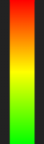
`"modern"`  | `LEDS_MODERN`  | Gradient-colored LEDs when [`colorMode`](#colormode) is set to `"gradient"` | 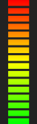
`"vintage"` | `LEDS_VINTAGE` | Single color LEDs, determined by the `level` property of each color - see [registerTheme()](#registertheme) | 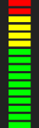

Please note that `"modern"` and `"vintage"` will have the same look when [`colorMode`](#colormode) is set to `"bar-level"` or `"bar-index"`, as each bar will be a single color anyway.

?> The height and spacing of LED elements can be customized via [`setLeds()`](#setleds) method.

For effect priority when combined with other settings, see [`isLedBars`](#isledbars-read-only).

### `linearAmplitude`

*Available since v4.0.0*

**Value:** a *boolean* value. The default value is `false`.

Whether to represent spectrum amplitudes in linear scale, instead of decibels (logarithmic).

This may improve the visualization of predominant tones, especially at higher frequencies, but it will make the entire spectrum look much quieter.

See also [`linearBoost`](#linearboost).

### `linearBoost`

*Available since v4.0.0*

**Value:** a *number*. The default value is `1`.

Performs an *n*th-root operation to amplify low energy values when using linear scale for the amplitude.

It should be a number >= 1, while 1 means no boosting. Only effective when [`linearAmplitude`](#linearamplitude) is set to *true*.

### `lineWidth`

*Available since v2.0.0*

**Value:** a *number*. The default value is `1`.

Line width for [Graph mode](#mode), or outline stroke in [frequency bands modes](#mode) when [`outlineBars`](#outlinebars) is *true*.

For the line to be distinguishable, set [`fillAlpha`](#fillalpha) < 1.

### `loRes`

**Value:** a *boolean* value. The default value is `false`.

Whether to use low resolution mode, which halves the effective pixel ratio, resulting in four times less pixels to render.

This may improve performance significantly, especially in 4K+ monitors.

?> If you want to allow users to interactively toggle low resolution mode, you may need to set a fixed size for the canvas via CSS, like so:

```css
canvas {
    display: block;
    width: 100%;
}
```

This will prevent the canvas size from changing, when switching the low resolution mode on and off.

### `maxDecibels`

**Value:** a *number*. The default value is `-25`.

Maximum amplitude value, in decibels, represented in the Y-axis of the analyzer.

Please note it must be a number less than or equal to zero, since 0 dB is the loudest sound possible.

See also [`minDecibels`](#mindecibels) and [`setSensitivity()`](#setsensitivity) .

### `maxFPS`

*Available since v4.2.0*

**Value:** a *number*. The default value is `0`.

Determines the maximum desired frame rate for the analyzer animation, in frames per second.

A value of `0` means the animation will run at the highest frame rate possible, limited by the refresh rate of your display.
For example, if you have a 144Hz monitor, the frame rate may reach up to 144 fps.

Usually, 60 fps is enough for a smooth animation, so setting `maxFPS` to `60` may help reducing CPU usage on high refresh rate monitors.

### `maxFreq`

**Value:** a *number*. The default value is `22000`.

Highest frequency represented in the X-axis of the analyzer, in Hertz (Hz).

The maximum allowed value is half the current sampling rate (which you can obtain via [`audioCtx.sampleRate`](#audioctx-read-only)), known as the [Nyquist frequency](https://en.wikipedia.org/wiki/Nyquist_frequency).
Values higher than that will be capped.

See also [`minFreq`](#minfreq) and [`setFreqRange()`](#setfreqrange).

### `minDecibels`

**Value:** a *number*. The default value is `-85`.

Minimum amplitude value, in decibels, represented in the Y-axis of the analyzer.

See also [`maxDecibels`](#maxdecibels) and [`setSensitivity()`](#setsensitivity) .

### `minFreq`

**Value:** a *number*. The default value is `20`.

Lowest frequency represented in the X-axis of the analyzer, in Hertz (Hz).

It must be a number greater than zero. Invalid values will be ignored.

See also [`maxFreq`](#maxfreq) and [`setFreqRange()`](#setfreqrange).

### `mirror`

*Available since v3.3.0*

**Value:** a *number*. The default value is `0`.

When [`channelLayout`](#channellayout-string) is **dual-horizontal**, this property controls the orientation of the X-axis (frequencies) on both channels.

For other layouts, it horizontally mirrors the spectrum image to the left or right side.

value  | Description
:-----:|-------------
`-1`   | Low frequencies meet at the center of the screen (mirror left)
`0`    | No mirror effect or change to axis orientation (default)
`1`    | High frequencies meet at the center of the screen (mirror right)

**Note:** On [`radial`](#radial) spectrum with channel layouts other than *dual-horizontal*, both `1` and `-1` have the same effect.

### `mode`

**Value:** a *string*. The default value is `"bars"`.

Determines the visualization mode.

value     | [Constant](#constants) | Description
----------|------------------------|-----------------
`"bars"`  | `MODE_BARS`  | displays bars for each frequency or frequency band
`"graph"` | `MODE_GRAPH` | connects frequency/bands data points into continuous line with optional filled area graph

See also [`bandResolution`](#bandresolution).

> **Migrating from legacy versions (< 5.0.0):**
>
> Legacy *mode* | `mode`  | `bandResolution`
> --------------|---------|------------------
> 0             | "bars"  | 0
> 1 through 8   | "bars"  | 9 *minus* legacy mode
> 10            | "graph" | 0

### `noteLabels`

*Available since v4.0.0*

**Value:** a *boolean* value. The default value is `false`.

Whether to displays musical note labels instead of frequency values, in the X-axis (when [`showScaleX`](#showscalex) is `true`).

For best visualization in [octave bands modes](#mode), make sure [`frequencyScale`](#frequencyscale) is set to `"log"`
and [`ansiBands`](#ansibands) is set to `false`, so bands are tuned to the equal temperament musical scale.

### `onCanvasDraw`

**Value:** a *function* or *undefined*. The default value is `undefined`.

A function to be called after **audioMotion-analyzer** finishes rendering each animation frame.

The callback function is passed two arguments: an *AudioMotionAnalyzer* object, and an object with the following properties:
- `timestamp`, a [*DOMHighResTimeStamp*](https://developer.mozilla.org/en-US/docs/Web/API/DOMHighResTimeStamp)
which indicates the elapsed time in milliseconds since the analyzer started running;
- `themes`, an array of the currently selected themes for the left (index 0) and right (index 1) analyzer channels.

Each element in the `themes` array is an object with the following structure:

```
{
	name: <string>,               // name of the theme active on this channel
	colorStops: <array>,          // each element is an object of { color: <string>, level: <number>, pos: <number> }
	gradient: <CanvasGradient>,
	mask: {
		colorStops: <array>,
		gradient: <CanvasGradient>
	}
}
```

Usage example:

```js
const audioMotion = new AudioMotionAnalyzer(
    document.getElementById('container'),
    {
        source: document.getElementById('audio'),
        onCanvasDraw: drawCallback
    }
);

function drawCallback( instance, { timestamp, themes } ) {
    const baseSize  = ( instance.isFullscreen ? 40 : 20 ) * instance.pixelRatio,
          canvas    = instance.canvas,
          centerX   = canvas.width / 2,
          centerY   = canvas.height / 2,
          ctx       = instance.canvasCtx,
          maxHeight = centerY / 2,
          maxWidth  = centerX - baseSize * 5,
          time      = timestamp / 1e4;

    // the energy value is used here to increase the font size and make the logo pulsate to the beat
    ctx.font = `${ baseSize + instance.getEnergy() * 25 * instance.pixelRatio }px Orbitron, sans-serif`;

    // use the right-channel gradient to fill text
    ctx.fillStyle = themes[ 1 ].gradient;
    ctx.textAlign = 'center';
    ctx.globalCompositeOperation = 'lighter';

    // the timestamp can be used to create effects and animations based on the elapsed time
    ctx.fillText( 'audioMotion', centerX + maxWidth * Math.cos( time % Math.PI * 2 ), centerY + maxHeight * Math.sin( time % Math.PI * 16 ) );
}
```

For more examples, see the fluid demo [source code](https://github.com/hvianna/audioMotion-analyzer/blob/master/demo/fluid.js) or [this pen](https://codepen.io/hvianna/pen/LYZwdvG).

### `onCanvasResize`

**Value:** a *function* or *undefined*. The default value is `undefined`.

A function to be called whenever the analyzer canvas is resized.

The callback function is passed two arguments: a *string* which indicates the reason that triggered the call (see below) and the *AudioMotionAnalyzer* object of the caller instance.

Reason       | Constant | Description
-------------|----------|-------------
`"create"`   | `REASON_CREATE` | canvas created by the **audioMotion-analyzer** [constructor](#constructor)
`"fullscreenchange"` | `REASON_FULLSCREENCHANGE` | analyzer entered or left fullscreen mode
`"lores"`    | `REASON_LORES`  | [low resolution option](#lores) toggled on or off
`"resize"`   | `REASON_RESIZE` |browser window or canvas container element were resized
`"user"`     | `REASON_USER`   |canvas dimensions changed by user script, via [`height`](#height) and [`width`](#width) properties, [`setCanvasSize()`](#setcanvassize-width-height-) or [`setOptions()`](#setoptions-options-) methods

Usage example:

```js
const audioMotion = new AudioMotionAnalyzer(
    document.getElementById('container'),
    {
        source: document.getElementById('audio'),
        onCanvasResize: ( reason, instance ) => {
            console.log( `[${reason}] canvas size is: ${instance.canvas.width} x ${instance.canvas.height}` );
        }
    }
);
```

### `outlineBars`

*Available since v3.6.0*

**Value:** a *boolean* value. The default value is `false`.

Whether to render analyzer bars outlined, with customizable [`fillAlpha`](#fillalpha) and [`lineWidth`](#linewidth).

Only effective in Bars [`mode`](#mode) with [`bandResolution`](#bandresolution) > 0.

For effect priority when combined with other settings, see [`isOutlineBars`](#isoutlinebars-read-only).

### `peakDecayTime`

*Available since v5.0.0; formerly `peakFadeTime` (since v4.5.0)*

**Value:** a *number*. The default value is `750`.

Time in milliseconds for peaks to fall down from maximum amplitude to zero, or to completely fade out (when [`fadePeaks`](#fadepeaks) is `true`).

It must be a number greater than or equal to zero. Invalid values are ignored.

See also [`peakHoldTime`](#peakholdtime) and [`showPeaks`](#showpeaks).

### `peakHoldTime`

*Available since v4.5.0*

**Value:** a *number*. The default value is `500`.

Time in milliseconds for peaks to hold their value before they begin to fall or fade.

It must be a number greater than or equal to zero. Invalid values are ignored.

See also [`fadePeaks`](#fadepeaks), [`peakDecayTime`](#peakdecaytime) and [`showPeaks`](#showpeaks).

### `peakLine`

*Available since v4.2.0*

**Value:** a *number*. The default value is `0`.

Determines the line width used to connect the amplitude peaks, when [`mode`](#mode) is set to `"graph"`. Has no effect in Bars mode.

A value of `0` means no line.

Please note that [`peaks`](#peaks) must be set to either `"drop"` or `"fade"`, although peak lines will always display the *"drop"* behavior.

### `peaks`

*Available since v5.0.0; formerly `showPeaks` (since v1.0.0)*

**Value:** a *string*. The default value is `"drop"`.

Determines the display and behavior of amplitude peaks.

value    | [Constant](#constants) | Description
---------|------------------------|--------------
`"off"`  | `PEAKS_OFF`  | Disable display of amplitude peaks (including [`peakLine`](#peakline))
`"drop"` | `PEAKS_DROP` | Display peaks that fall down over time
`"fade"` | `PEAKS_FADE` | Display peaks that fade out over time

See also [`peakDecayTime`](#peakdecaytime) and [`peakHoldTime`](#peakholdtime).

### `pixelRatio` *(read only)*

**Value:** a *number*.

Current [devicePixelRatio](https://developer.mozilla.org/en-US/docs/Web/API/Window/devicePixelRatio).
This is usually **1** for standard displays and **2** (or higher) for retina / Hi-DPI screens.

Its value is halved when [`loRes`](#lores) is `true`.

You can refer to this value to adjust any additional drawings done in the canvas (via [callback function](#oncanvasdraw)).

### `radial`

*Available since v2.4.0*

**Value:** a *number*. The default value is `0`.

Whether to render the spectrum analyzer as a circle with radial bars.

value | [Constant](#constants) | Description
------|------------------------|----------------
`0`   | `RADIAL_OFF`   | Disables radial
`1`   | `RADIAL_OUTER` | Bars grow towards the edges of the screen
`-1`  | `RADIAL_INNER` | Bars grow towards the center of the screen

When [`channelLayout`](#channellayout) is set to `"dual-vertical"`, left channel bars grow outwards and right channel bars grow inwards, so both `1` and `-1` values have the same effect.

In radial view, [`ledBars`](#ledbars) effect is disabled.

See also [`radius`](#radius) and [`spinSpeed`](#spinspeed).

!> [See related known issue](#alphabars-and-fillalpha-wont-work-with-radial-on-firefox)

### `radius`

*Available since v4.4.0*

**Value:** a *number*. The default value is `0.5`.

Determines the inner radius of [`radial`](#radial) spectrum. It should be a number between `0.0` and `1.0`.

This property has no effect when [`channelLayout`](#channellayout-string) is set to `"dual-vertical"`.

When [`radial`](#radial) is set to `-1`, this property controls how close to the center of the screen the bars can get.

### `reflexAlpha`

*Available since v2.1.0*

**Value:** a *number*. The default value is `0.15`.

Determines the reflection opacity. Only effective when [`reflexRatio`](#reflexratio) > 0.

It must be a number between `0.0` (completely transparent) and `1.0` (completely opaque).

### `reflexBright`

*Available since v2.3.0*

**Value:** a *number*. The default value is `1`.

Determines the reflection brightness. Only effective when [`reflexRatio`](#reflexratio) > 0.

Values lower than 1 darken the reflection, while values greater than 1 make it brighter.

!> [See related known issue](#reflexbright-wont-work-on-some-browsers)

### `reflexFit`

*Available since v2.1.0*

**Value:** a *boolean* value. The default value is `true`.

Whether to shrink or stretch the analyzer reflection to fit the canvas. Only effective when [`reflexRatio`](#reflexratio) > 0.

When set to `false`, the reflected image may be cut at the bottom (when [`reflexRatio`](#reflexratio) < 0.5) or not fill the entire canvas (when [`reflexRatio`](#reflexratio) > 0.5).

### `reflexRatio`

*Available since v2.1.0*

**Value:** a *number*. The default value is `0`.

Determines the percentage of canvas height used for reflection.

It must be a number greater than or equal to `0` (no reflection), but less than `1`. Values out of range will be ignored.

For a perfect mirrored effect, set `reflexRatio` to `0.5` and both [`reflexAlpha`](#reflexalpha) and [`reflexBright`](#reflexbright) to `1`.

This has no effect when [`alphaBars`](#alphaBars) is set to `"full"`.

### `roundBars`

*Available since v4.1.0*

**Value:** a *boolean* value. The default value is `false`.

Whether to render analyzer bars with rounded corners at the top. Only effective for Bars [`mode`](#mode) with [`bandResolution`](#bandresolution) > 0.

In [`radial`](#radial) view this makes the top and bottom of bars to follow the curvatures of the outer and inner circles, respectivelly, although the effect
can be barely noticeable with [`bandResolution`](#bandresolution) > `2` (half-octave bands).

This has no effect when [`ledBars`](#ledbars) is set to `true` or [`alphaBars`](#alphabars) is set to `"full"`.

See also [`isRoundBars`](#isroundbars-read-only).

### `showFPS`

**Value:** a *boolean* value. The default value is `false`.

Whether to display the current frame rate at the top right corner.

### `showLedMask`

**Value:** a *boolean* value. The default value is `true`.

Whether to display the "unlit" LED elements. Has no effect when [`ledBars`](#ledbars) is set to `"off"`.

`showLedMask` = *false* | `showLedMask` = *true*
:----------------------:|:-----------------------:
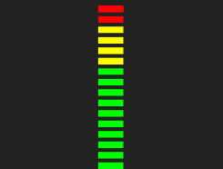 | 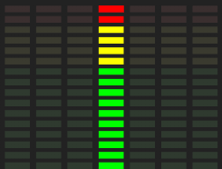

### `showScaleX`

*Available since v3.0.0; formerly `showScale` (since v1.0.0)*

**Value:** a *boolean* value. The default value is `true`.

Whether to display scale labels on the X-axis.

Several properties of the scale can be customized via [`setXAxis()`](#setxaxis) method.

See also [`noteLabels`](#notelabels).

### `showScaleY`

*Available since v2.4.0*

**Value:** a *boolean* value. The default value is `false`.

Whether to display the level/amplitude scale on the Y-axis.

This option has no effect when [`radial`](#radial) is active or [`alphaBars`](#alphabars) is set to `"full"`.

When [`linearAmplitude`](#linearamplitude) is set to *false* (default), labels are shown in decibels (dB);
otherwise, values represent a percentage (0-100%) of the maximum amplitude.

Several properties of the scale can be customized via [`setYAxis()`](#setyaxis) method.

See also [`minDecibels`](#mindecibels) and [`maxDecibels`](#maxdecibels).

### `smoothing`

**Value:** a *number*. The default value is `0.5`.

Determines the analyzer's [smoothingTimeConstant](https://developer.mozilla.org/en-US/docs/Web/API/AnalyserNode/smoothingTimeConstant).

It must be a number between `0.0` and `1.0`. Lower values make the analyzer respond faster to changes.

### `spinSpeed`

*Available since v2.4.0*

**Value:** a *number*. The default value is `0`.

Determines the rotation speed of the [`radial`](#radial) analyzer, in revolutions per minute.

Positive values will make the analyzer rotate clockwise, while negative values will make it rotate counterclockwise. A value of `0` means no rotation.

### `spreadGradient`

*Available since v5.0.0; formerly `splitGradient` (since v3.0.0)*

**Value:** a *boolean* value. The default value is `false`.

When set to `true` causes the gradient to spread between both channels.

Only effective when [`channelLayout`](#channellayout-string) is set to `"dual-vertical"`, or `"dual-horizontal"` with `horizontal` [theme modifier](#setthememodifiers) set to `true`.

For best effect it is recommended to use the same color theme for both channels.

The effect is illustrated below, using the *"classic"* [theme](#theme-string) on dual-vertical channel layout.

| spreadGradient: *false* | spreadGradient: *true* |
|:--:|:--:|
|  | 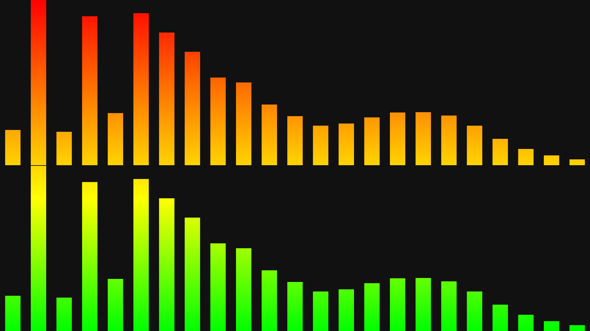 |

### `useCanvas`

*Available since v3.5.0*

**Value:** a *boolean* value. The default value is `true`.

Whether or not to render analyzer graphics to the [`canvas`](#canvas-read-only).
Setting it to `false` in the [**constructor**](#constructor) options also prevents the canvas from being added to the container.

Please note that the analyzer processing runs regardless of the value of `useCanvas` and any callback defined for [`onCanvasDraw`](#oncanvasdraw)
will still be triggered on every animation frame, so you can use the [`getBars()`](#getbars) method to create your own visualizations.

If you want to completely stop the analyzer's data processing, see [`stop()`](#stop).

### `volume`

*Available since v3.0.0*

Output volume.

**Value:** a *number* value. The default value is `1`.

A value of `0` will mute the sound output, while a value of `1` will preserve the same input volume.
Values higher than `1` can be used to amplify the input, but it may cause distortion.

Please note that changing the volume on the audio element will affect the amplitude of analyzer graphs, while this property does not.

### `weightingFilter`

*Available since v4.0.0*

[Weighting filter](https://en.wikipedia.org/wiki/Weighting_filter) applied to analyzer data, for spectrum visualization only.


**Value:** a *string*. The default value is `""`.

Value   | [Constant](#constants) | Description
--------|------------------------|---------------
`""`    | `FILTER_NONE` | No weighting applied (default)
`"A"`   | `FILTER_A`    | A-weighting
`"B"`   | `FILTER_B`    | B-weighting
`"C"`   | `FILTER_C`    | C-weighting
`"D"`   | `FILTER_D`    | D-weighting
`"468"` | `FILTER_468`  | ITU-R 468 weighting

?> Weighting filters only affect the visualization, **NOT** the audio output.

Each filter applies a different curve of gain/attenuation to specific frequency ranges, but the general idea is to adjust the
visualization of frequencies to the sensitivity of the human ear.

Refer to the [weighting filters viewer tool](/tools/weighting-filters.html) for response tables and an interactive version of the curves graph seen below.

### `width`

Nominal width of the analyzer.

**Value:** a *number* or *undefined*. The default value is `undefined`.

See [`height`](#height) for more details.


## Static properties

### `version` *string* *(Read only)*

*Available since v3.0.0*

Returns the version of the **audioMotion-analyzer** package.

Since this is a static property, you should always access it as `AudioMotionAnalyzer.version` - this allows you to check the package version even before instantiating your object.


## Methods

### `connectInput( source )`

*Available since v3.0.0*

Connects an [HTMLMediaElement](https://developer.mozilla.org/en-US/docs/Web/API/HTMLMediaElement) or an [AudioNode](https://developer.mozilla.org/en-US/docs/Web/API/AudioNode)
(or any of its descendants) to the analyzer.

If `source` is an *HTMLMediaElement*, the method returns a [MediaElementAudioSourceNode](https://developer.mozilla.org/en-US/docs/Web/API/MediaElementAudioSourceNode) created
for that element; if `source` is an *AudioNode* instance, it returns the `source` object itself; if it's neither an [ERR_INVALID_AUDIO_SOURCE](#custom-errors) error is thrown.

See also [`disconnectInput()`](#disconnectinput-node-stoptracks-) and [`connectedSources`](#connectedsources-array-read-only).

### `connectOutput( [node] )`

*Available since v3.0.0*

This method allows connecting the analyzer **output** to other audio processing modules that use the Web Audio API.

`node` must be an [*AudioNode*](https://developer.mozilla.org/en-US/docs/Web/API/AudioNode) instance.

By default, the analyzer is connected to the speakers upon instantiation, unless you set [`connectSpeakers: false`](#connectspeakers) in the constructor options.

See also [`disconnectOutput()`](#disconnectoutput-node-) and [`connectedTo`](#connectedto-array-read-only).

?> If called with no argument, analyzer output is connected to the speakers (the *AudioContext* `destination` node).

### `destroy()`

*Available since v4.2.0*

Destroys the **audioMotion-analyzer** instance and release resources. A destroyed analyzer cannot be started again.

This method:

+ Stops the analyzer data processing and animation;
+ Disconnects all input and output nodes;
+ Clears event listeners and callback functions;
+ Stops the *AudioContext* created by this instance (won't affect context provided to the [constructor](#constructor) via [`audioCtx`](#audioctx-audiocontext-object) property or an *AudioNode* [`source`](#source-htmlmediaelement-or-audionode-object));
+ Removes the [`canvas`](#canvas-htmlcanvaselement-object-read-only) from the DOM.

See usage example in the [minimal demo](/demo/minimal.html).

See also [`isDestroyed`](#isdestroyed-read-only).

### `disconnectInput( [node], [stopTracks] )`

*Available since v3.0.0; `stopTracks` parameter since v4.2.0*

Disconnects audio source nodes previously connected to the analyzer.

`node` may be an *AudioNode* instance or an **array** of such objects. If it's **undefined** (or any [*falsy*](https://developer.mozilla.org/en-US/docs/Glossary/Falsy) value),
**all connected sources are disconnected.**

`stopTracks` is a boolean value; if **true**, permanently stops all audio tracks from any [*MediaStream*](https://developer.mozilla.org/en-US/docs/Web/API/MediaStream)s being
disconnected, e.g. a microphone. Use it to effectively release the stream if it's no longer needed.

Please note that when you have connected an `<audio>` or `<video>` element, you need to disconnect the respective [MediaElementAudioSourceNode](https://developer.mozilla.org/en-US/docs/Web/API/MediaElementAudioSourceNode)
created for it. The node reference is returned by [`connectInput()`](#connectinput-source-), or can be obtained from [`connectedSources`](#connectedsources-array-read-only)
if the element was connected via [`source`](#source-htmlmediaelement-or-audionode-object) constructor option.

### `disconnectOutput( [node] )`

*Available since v3.0.0*

Disconnects the analyzer output from previously connected audio nodes.

`node` must be a connected *AudioNode*.

See also [`connectOutput()`](#connectoutput-node-).

?> If called with no argument, analyzer output is disconnected from all nodes, **including the speakers!**

### `getBars()`

*Available since v3.5.0*

Returns an array with current data for each analyzer bar. Each array element is an object with the format below:

```js
{
	posX: <number>,   // horizontal position of this bar on the canvas
	freq: <number>,   // center frequency for this bar (added in v4.0.0)
	freqLo: <number>, // lower edge frequency
	freqHi: <number>, // upper edge frequency
	peak: <array>,    // peak values for left and right channels
	hold: <array>,    // peak hold frames for left and right channels - values < 0 mean the peak is fading or falling down
	value: <array>    // current amplitude on left and right channels
}
```

`peak` and `value` elements are floats between 0 and 1, relative to the lowest and highest volume levels defined by [`minDecibels`](#mindecibels) and [`maxDecibels`](#maxdecibels).

`hold` values are integers and indicate the hold time (in frames) for the current peak.
Negative values mean the peak is currently fading or falling down, depending on the value of [`fadePeaks`](#fadepeaks).

Please note that `hold` and `value` will have only one element when [`channelLayout`](#channellayout-string) is set to *'single'*, but `peak` is always a two-element array.

You can use this method to create your own visualizations using the analyzer data. See [this pen](https://codepen.io/hvianna/pen/ZEKWWJb) for usage example.

### `getEnergy()`

*Available since v3.2.0*

Returns the amplitude of a specific frequency, or the average energy of a frequency range.

**Syntax:**

```js
getEnergy()
getEnergy(preset)
getEnergy(freq)
getEnergy(startFreq, endFreq)
```

**If called with no parameters, it returns the overall spectrum energy** obtained by the average of amplitudes of the *currently displayed frequency bands*.

Parameter | type | description
----------|------|---------------
`preset`  | *string* | Name of a predefined frequency range, or "peak" (see below)
`freq`    | *number* | A single frequency to analyze, in Hertz
`startFreq` | *number* | Inital frequency to analyze, in Hertz
`endFreq` | *number* | Ending frequency to analyze, in Hertz

Preset      | [Constant](#constants) | Description
------------|------------------------|------------------
`"peak"`    | `ENERGY_PEAK`          | peak overall energy value of the last 30 frames (approximately 0.5s)
`"bass"`    | `ENERGY_BASS`          | average energy between 20 and 250 Hz
`"lowMid"`  | `ENERGY_LOWMID`        | average energy between 250 and 500 Hz
`"mid"`     | `ENERGY_MIDRANGE`      | average energy between 500 and 2000 Hz
`"highMid"` | `ENERGY_HIGHMID`       | average energy between 2000 and 4000 Hz
`"treble"`  | `ENERGY_TREBLE`        | average energy between 4000 and 16000 Hz

Please note that preset names are case-sensitive!

Use this method inside your callback function to create additional visual effects. See the [fluid demo](/demo/fluid.html) or [this pen](https://codepen.io/hvianna/pen/poNmVYo) for examples.

**Return value:** a *number* between `0.0` and `1.0`, or `null` if preset name is invalid.

### `getOptions()`

*Available since v4.4.0*

Returns current analyzer settings.

**Syntax:**

```js
getOptions()
getOptions(ignore)
```

Parameter | type | description
----------|------|------------------
`ignore`  | *string* or *array* | a single property name or an array of property names that should **NOT** be included in the returned object

Callbacks and [constructor-specific properties](#constructor-specific-options) are NOT included in the object.

**Return value:** an [*Options object*](#options-object).

See also [`setOptions()`](#setoptions).

### `getTheme()`

*Available since v5.0.0*

Returns the name of the theme set for the given channel.

**Syntax:**

```js
getTheme()
getTheme(channel, includeModifiers)
getTheme(includeModifiers)
```

Parameter | type | description
----------|------|-----------------
`channel` | *number* | *(optional)* channel to set (`0` = left, `1` = right) - if not specified, considers channel 0
`includeModifiers` | *boolean* | *(optional)* `true` to also return the state of theme modifiers

**Return value:** a *string* representing the theme name, or an *object* with `name` and `modifiers` properties.

See also [`setTheme()`](#settheme).

### `getThemeData()`

*Available since v5.0.0*

Returns a given theme's color properties.

**Syntax:**

```js
getThemeData(name)
```

`name` must be a *string* representing the name of an available theme - see [`getThemeList()`](#getthemelist).

**Return value:** an *object* (structure below) or `null` if theme name is invalid.

property | type | description
---------|------|---------------
`colorStops` | *array*  | all entries are normalized as objects with `color`, `level` and `pos` properties
`peakColor`  | *string* | `undefined` if not originally defined in [theme registration](#registertheme)

**Example usage:**

```js
console.log( audioMotion.getThemeData('classic') );

{
  colorStops: [
    { color: "red", level: 1, pos: 0 },
    { color: "yellow", level: 0.9, pos: 0.5 },
    { color: "lime", level: 0.6, pos: 1 }
  ],
  peakColor: undefined
}
```

### `getThemeList()`

*Available since v5.0.0*

Returns the names of available themes, including built-in and custom registered themes.

**Parametes:** none.

**Return value:** an *array* of *string*s.

### `registerTheme()`

*Available since v5.0.0; formerly `registerGradient()` (since v1.0.0)*

Registers a custom color theme.

**Syntax:**

```js
registerTheme(name, options)
```

parameter | type | description
----------|------|-------------
`name`    | *string* | Names are **case sensitive** and will be used to select the theme via [`setTheme()`](#settheme) method.
`options` | *object* | Contains the color information (see below).

**`options` object structure:**

property     | type   | description
-------------|--------|-------------
`colorStops` | *array*  | **At least one array element is required.** Each one must be either a *string* (color in CSS format), or an *object* (see below).
`peakColor`  | *string* | Optional; if defined, **all peaks** will be painted this color, regardless of their levels.

**`colorStops` color object structure:**

property | type   | description
---------|--------|-------------
`color`  | *string* | Any valid CSS color format, e.g. 'red', '#f00', 'rgb(…)', 'hsl(…)', etc.
`level`  | *number* | Optional; sets the **upper level** threshold for applying this color to a bar (when [`colorMode`](#colormode-string) is set to `"bar-level"`) or LED segment (when [`ledBars`](#ledbars) is set to `"vintage"`). It must be a number between `0` and `1`, where `1` is the maximum amplitude (top of screen).
`pos`    | *number* | Optional; adjusts the position of a color within the generated gradient, applied when [`colorMode`](#colormode-string) is set to `"gradient"`. It must be a number between `0` and `1`, where **`0` represents the top of the screen.**

**Notes:**

- All colorStops will be normalized as color objects after registration, and missing `pos` and `level` values will be automatically calculated for uniform color distribution - you can obtain the computed values via [`getThemeData()`](#getthemedata);
- Defining `level: 0` for a colorStop will effectively prevent that color from being used when [`colorMode`](#colormode-string) is set to `"bar-level"` or [`ledBars`](#ledbars) is set to `"vintage"`;

**Return value:** a *boolean* value, `true` on success or `false` on error (it does NOT throw an error, but a detailed warning message is logged to the console).

Example usage:

```js
audioMotion.registerTheme( 'classic-A', {
    colorStops: [ 'red', 'yellow', 'lime' ] // automatic color distribution
});

audioMotion.registerTheme( 'classic-B', {
    colorStops: [                       // custom levels, but auto gradient positions
        { color: 'red' },               // top color is always assigned level: 1 (amplitude 100% and lower)
        { color: 'yellow', level: .9 }, // use this color for amplitude ≤ 90% (but > 60%)
        { color: 'lime', level: .6 }    // use this color for amplitude ≤ 60%
    ]
});

audioMotion.registerTheme( 'bluey-A', {
    colorStops: [                       // only colors are defined, so automatic distribution is done
        { color: 'red' },               // this will be assigned level: 1, pos: 0
        { color: '#1ea1df' }            // this will be assigned level: 0.5, pos: 1
    ]                                   // note that level decreases, while pos increases, from top to bottom
});

audioMotion.registerTheme( 'bluey-B', {
    colorStops: [
        { color: 'red' },                         // auto-assigned
        { color: '#1ea1df', level: .9, pos: .15 } // set level and fine-tune gradient position, for similar look
    ]
});
```

Theme | [`ledBars`](#ledbars) = `"off"` | [`ledBars`](#ledbars) = `"vintage"` | [`colorMode`](#colormode-string) = `"bar-level"`
------|:--------:|:-----------------------------------:|:------------------------------------------------:
**classic-A**<br>(auto `pos` / auto `level`)     |  | 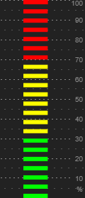 | 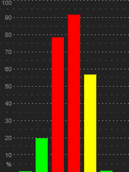
**classic-B**<br>(auto `pos` / custom `level`)   | 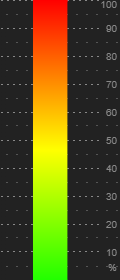 | 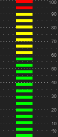 | 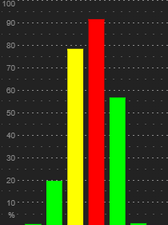
**bluey-A**<br>(auto `pos` / auto `level`)       | 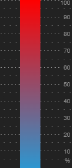 | 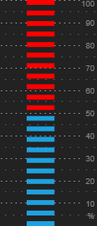 | 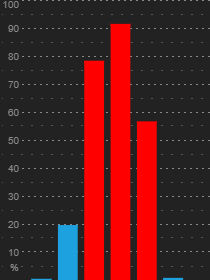
**bluey-B**<br>(custom `pos` / custom `level`)   | 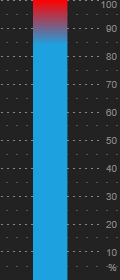 | 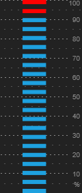 | 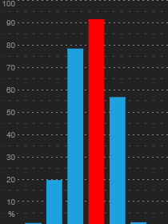


See also: [unregisterTheme()](#unregistertheme-name)

?> Any color theme, including the built-in ones, may be modified at any time by simply re-registering the same theme name.

### `setCanvasSize()`

Shortand hand method for setting both [`height`](#height) and [`width`](#width) properties at once.

**Syntax:**

```js
setCanvasSize(width, height)
```

**Return value:** none (`undefined`).

### `setFreqRange()`

Shortand hand method for setting both [`minFreq`](#minfreq) and [`maxFreq`](#minfreq) properties at once.

**Syntax:**

```js
setFreqRange(minFreq, maxFreq)
```

**Return value:** none (`undefined`).

### `setLeds()`

*Available since v5.0.0; formerly `setLedParams()` (since v3.2.0)*

Customizes the appearance of LED elements used to create the [`ledBars`](#ledbars) effect.

**Syntax:**

```js
setLeds(ledHeight, gapHeight)
```

parameter   | type     | description     | default
------------|----------|-----------------|----------:
`ledHeight` | *number* | Height, in pixels, of each LED element. **A value of `0` will match the bar width (generates square LEDs).** | `8`
`gapHeight` | *number* | Vertical gap, in pixels, between two consecutive LED elements. **A value of `0` will match the current [bar spacing](#barSpace).** | `8`

**If called with no argument, or if ANY of the values is invalid, BOTH parameters are reset to their default values.**

**Return value:** none (`undefined`).

?> You can experiment with different values in the [fluid demo](https://audiomotion.dev/demo/fluid.html).

### `setOptions()`

Shorthand method for setting several analyzer [properties](#properties) at once.

**Syntax:**

```js
setOptions()
setOptions(options)
```

`options` must be an [**Options object**](#options-object). **If not passed (or `undefined`), all properties are reset to their default values.**

**Return value:** none (`undefined`).

See also [`getOptions()`](#getoptions).

### `setSensitivity()`

Shorthand method for setting both [`minDecibels`](#mindecibels) and [`maxDecibels`](#maxdecibels) properties at once.

**Syntax:**

```js
setSensitivity(minDecibels, maxDecibels)
```

**Return value:** none (`undefined`).

### `setTheme()`

*Available since v5.0.0*

Sets the color theme for one or both analyzer channels.

**Syntax:**

```js
setTheme(name, channel)
setTheme(name, modifiers, channel)
setTheme(themeObject, channel)
```

Parameter     | type   | description
--------------|--------|------------------
`name`        | *string* or *array* | theme name, or an array of theme names - must be a name as returned by [`getThemeList()`](#getthemelist)
`modifiers`   | *object* | *(optional)* a modifiers object, as returned by [`getThemeModifiers()`](#getthememodifiers)
`themeObject` | *object* or *array* | a theme object, as returned by [`getTheme()`](#gettheme) or an array of such objects
`channel`     | *number* | *(optional)* channel to set (`0` = left, `1` = right)

When passing arrays for `name` or `themeObject` you can assign different themes to each channel at once.
When using a single `name` or `themeObject`, if `channel` is not specified, the same theme will be applied to both channels.

!> Note that when setting theme modifiers, properties not defined in the passed object will be reset to their default values. To selectively enable or disable modifiers while preserving others, use [`setThemeModifiers( name, state )`](#setthememodifiers).

**Return value:** none (`undefined`).

See also [`channelLayout`](#channellayout), [`registerTheme()`](#registertheme) and [`spreadGradient`](#spreadgradient).

### `setThemeModifiers()`

**Syntax:**

```js
setThemeModifiers()
setThemeModifiers(modifier, state, channel)
setThemeModifiers(modifiersObject, channel)
```

Parameter     | type   | description
--------------|--------|------------------
`modifier`    | *string* | modifier to set (see below)
`state`       | *boolean* | desired state for selected modifier
`modifiersObject` | *object* | modifiers object, as returned by [`getThemeModifiers()`](#getthememodifiers)
`channel`         | *number* | *(optional)* channel to set (`0` = left, `1` = right)

Modifier | description
---------|----------------
`"horizontal"` | Renders the color gradient horizontally across the screen, instead of vertically - has no effect in [`radial`](#radial) spectrum or when [`ledBars`](#ledbars) is set to `"vintage"`
`"revert"`     | Reverts the order of the theme colors

**Return value:** none (`undefined`).

### `setXAxis()`

*Available since v5.0.0*

Customize the appearance of the X-axis labels.

**Syntax:**

```js
setXAxis()
setXAxis(options)
```

**If called with no argument, all properties will be reset to their default values.**

If `options` is defined, it should be an object with the structure below (all properties are optional).

property           | type      | description | default
-------------------|-----------|-------------|---------
`addLabels`        | *boolean* | Contents of `labels` will be *added* to the default labels, instead of replacing them | `false`
`backgroundColor`  | *string*  | Background color of the X-axis; any valid CSS color format is acceptable; use a blank string or 'transparent' for fully transparent background | `"#0008"`
`color`            | *string*  | Color of labels | `"#fff"`
`height`           | *number*  | Height of the X-axis; a number between `0.0` and `1.0` (recommended for responsivity) represents a fraction of the canvas width or height, whichever is smaller; numbers greater than 1 represent a fixed value in pixels | `0.03`
`highlightColor`   | *string*  | Color used to highlight *C* notes when [`noteLabels`](#notelabels) is *true*, or those highlighted via `labels` definition (see below) | `"#4f4"`
`labels`           | *array*   | Custom labels; each element of the array must be either a number, representing the frequency, or an array of [frequency&lt;number&gt;, label&lt;string&gt;, highlight?&lt;boolean&gt;] | octaves center frequencies
`overlay`          | *boolean* | Whether the X-axis should overlay the bottom of the analyzer area | `false`

**Return value:** none (`undefined`).

**Example usage:**

```js
audioMotion.setXAxis({
    addLabels: true,       // add custom labels on top of default ones
    backgroundColor: '',   // transparent background on the axis bar
    labels: [
      [ 440, 'A4', true ], // highlight A4 label at 440 Hz
      800,                 // additional label at 800 Hz
      [ 3000, '|' ],       // just a tick mark at 3 kHz
    ],
});
```

> **Notes:**
>
> - The axis height also defines the labels font size (half its value). A minimum of 20 pixels is enforced for the computed `height` value;
> - Custom labels are not displayed when [`noteLabels`](#notelabels) is *true*.

### `setYAxis()`

*Available since v5.0.0*

Customize the appearance of the Y-axis labels.

**Syntax:**

```js
setYAxis()
setYAxis(options)
```

 **If called with no argument, all properties will be reset to their default values.**

If `options` is defined, it should be an object with the structure below (all properties are optional).

property         | type    | description | default
-----------------|---------|-------------|---------
color            | string  | Color of labels and lines | `"#888"`
dbInterval       | number  | Interval between labels, in decibels - used when [`linearAmplitude`](#linearamplitude) is *false* | `10`
linearInterval   | number  | Interval between labels, in percentage values - used when [`linearAmplitude`](#linearamplitude) is *true* | `20`
lineDash         | array   | Line style - [format reference](https://developer.mozilla.org/en-US/docs/Web/API/CanvasRenderingContext2D/setLineDash) | `[2,4]`
operation        | array   | Compositing operation used to draw labels and lines - [Reference](https://developer.mozilla.org/en-US/docs/Web/API/CanvasRenderingContext2D/globalCompositeOperation) | `"destination-over"`
showSubdivisions | array   | Whether to show subdivision lines between two labels | `true`
subLineColor     | string  | Line color used for subdivisions | `"#555"`
subLineDash      | array   | Line style for subdivisions (see `lineDash` above) | `[2,8]``
width            | number  | Width of the Y-axis; a number between `0.0` and `1.0` represents a fraction of the canvas width or height, whichever is smaller; numbers greater than `1` represent a fixed value in pixels | `0.03`

**Return value:** none (`undefined`).

**Example usage:**

```js
audioMotion.setYAxis({
  linearInterval: 10,
  operation: 'screen',
  showSubdivisions: false,
});
```

> **Notes:**
>
> - The axis width also affects the labels font size (half its value). A minimum of 20 pixels is enforced for the computed `width` value;
> - Some values of `operation` may make the visualization of analyzer graphs impossible.

### `start()`

*Available since v4.2.0*

Starts the analyzer data processing and animation.

The analyzer is started by default after initialization, unless you specify [`start: false`](#start) in the [constructor](#constructor) options.

**Return value:** none (`undefined`).

See also [`stop()`](#stop), [`toggleAnalyzer()`](#toggleanalyzer-) and [`isOn`](#ison-read-only).

### `stop()`

*Available since v4.2.0*

Stops the analyzer process.

When the analyzer is off, no audio data is processed and no callbacks to [`onCanvasDraw`](#oncanvasdraw-function) will be triggered.

The analyzer can be resumed with [`start()`](#start) or [`toggleAnalyzer()`](#toggleanalyzer-).

**Return value:** none (`undefined`).

See also [`destroy()`](#destroy) and [`isOn`](#ison-read-only).

### `toggleAnalyzer()`

Toggles the analyzer process state.

**Syntax:**

```js
toggleAnalyzer()
toggleAnalyzer(force)
```

parameter | type | description
----------|------|------------
`force`   | *boolean* | forces the desired state - `true` to start or `false` to stop the analyzer

**Return value:** a *boolean* value, representing the resulting state.

See also [`start()`](#start), [`stop()`](#stop) and [`isOn`](#ison-read-only).

### `toggleFullscreen()`

Toggles fullscreen mode on / off.

By default, only the canvas is sent to fullscreen.
You can set the [`fsElement`](#fselement-htmlelement-object) constructor option to a parent container, to keep desired interface elements visible during fullscreen.

**Return value:** none (`undefined`).

?> Fullscreen requests must be triggered by user action, like a key press or mouse click, so you must call this method from within a user-generated event handler.


## Custom Errors

*Available since v2.0.0*

**audioMotion-analyzer** uses a custom error object to throw errors.

The `code` property is a *number*. [Constants](#constants) are available to simplify checking for error codes.

code | Constant            | Error description
-----|---------------------|--------------------
`1`  | `ERR_AUDIO_CONTEXT_FAIL`    | Could not create audio context. The user agent may lack support for the Web Audio API.
`2`  | `ERR_INVALID_AUDIO_CONTEXT` | [Audio context](#audioctx-read-only) provided by user is not valid.
`3`  | `ERR_INVALID_AUDIO_SOURCE`  | Audio source provided in [`source`](#source) option or [`connectInput()`](#connectinput) method is not an instance of HTMLMediaElement or AudioNode.


## Known Issues

### reflexBright won't work on Safari <!-- {docsify-ignore} -->

[`reflexBright`](#reflexbright) feature relies on the [`filter`](https://developer.mozilla.org/en-US/docs/Web/API/CanvasRenderingContext2D/filter) property of the Canvas API,
which is [currently not supported by Safari](https://caniuse.com/#feat=mdn-api_canvasrenderingcontext2d_filter).

### alphaBars and fillAlpha won't work with Radial on Firefox <!-- {docsify-ignore} -->

On Firefox, [`alphaBars`](#alphaBars) and [`fillAlpha`](#fillalpha) won't work with [`radial`](#radial) spectrum when using hardware acceleration, due to [this bug](https://bugzilla.mozilla.org/show_bug.cgi?id=1164912).

### Visualization of live streams won't work on Safari <!-- {docsify-ignore} -->

Safari's implementation of Web Audio won't return analyzer data for live streams, as documented in [this bug report](https://bugs.webkit.org/show_bug.cgi?id=195043).


## Troubleshooting

Common problems and solutions. Remember to check the browser console for error messages.

### Error message: `Cannot use import statement outside a module` <!-- {docsify-ignore} -->

The `import` statement must be inside a `script` which has the `type="module"` property (and no `type="text/javascript"`), like so:

```html
  <script type="module">
    import AudioMotionAnalyzer from 'https://cdn.skypack.dev/audiomotion-analyzer@alpha?min';

    // your code here
  </script>
```

Or

```html
  <script src="main.js" type="module"></script>
```

### Error message: `MediaElementAudioSource outputs zeroes due to CORS access restrictions` <!-- {docsify-ignore} -->

Make sure the media element (`audio` or `video` tag) connected to **audioMotion-analyzer** has the `crossorigin="anonymous"` property, like so:

```html
<audio id="myAudio" src="https://example.com/stream" controls crossorigin="anonymous"></audio>
```

You can also set the `crossOrigin` (mind the uppercase "O") property via JavaScript, like so:

```js
myAudio.crossOrigin = 'anonymous';
```

### Sound only plays after the user clicks somewhere on the page. <!-- {docsify-ignore} -->

Browser autoplay policy dictates that audio output can only be initiated by a user gesture, and this policy is enforced by Web Audio API
by putting [*AudioContext*](#audioctx-audiocontext-object-read-only) objects into *suspended* mode if they're not created on user action.

**audioMotion-analyzer** tries to automatically start its *AudioContext* on the first click on the page. However, if you're using an `audio`
or `video` element with the `controls` property, clicks on those native media controls cannot be detected by JavaScript, so the audio will
only be enabled if/when the user clicks somewhere else.

Possible solutions are:

1. Ensure your users have to click somewhere else before using the native media controls, like a "power on" button;

1. Don't use the native controls at all, and create your own custom play and stop buttons;

1. Even better, instantiate your **audioMotion-analyzer** object within a function triggered by a user click. This will allow the *AudioContext* to
be started right away and will also prevent the *"The AudioContext was not allowed to start"* warning message from appearing in the browser console.

See the [minimal demo](/demo/minimal.html) code for an example.


## References and acknowledgments

* Thanks to my wife, Virginia, for her never-ending love and support! 💞
* Thanks to [Yuji Koike](http://www.ykcircus.com) for his awesome [Soniq Viewer for iOS](https://itunes.apple.com/us/app/soniq-viewer/id448343005), which inspired me to create **audioMotion**
* Thanks to all [code contributors](https://github.com/hvianna/audioMotion-analyzer/graphs/contributors) and [donators](https://ko-fi.com/hvianna#middleColumn)
* [HTML Canvas Reference @W3Schools](https://www.w3schools.com/tags/ref_canvas.asp)
* [Web Audio API specification](https://webaudio.github.io/web-audio-api/)
* [Web Audio API documentation @MDN](https://developer.mozilla.org/en-US/docs/Web/API/Web_Audio_API)
* [What does the FFT data in the Web Audio API correspond to?](https://stackoverflow.com/a/14789992/2370385)
* [Equations for equal-tempered scale frequencies](http://pages.mtu.edu/~suits/NoteFreqCalcs.html)
* [Making Audio Reactive Visuals](https://www.airtightinteractive.com/2013/10/making-audio-reactive-visuals/)
* The font used in audioMotion's logo is [Orbitron](https://fonts.google.com/specimen/Orbitron) by Matt McInerney
* The _prism_ and _rainbow_ gradients use the [12-bit rainbow palette](https://iamkate.com/data/12-bit-rainbow/) by Kate Morley
* This documentation website is powered by [GitHub Pages](https://pages.github.com/), [docsify](https://docsify.js.org/) and [docsify-themeable](https://jhildenbiddle.github.io/docsify-themeable)


## Changelog

See [Changelog.md](Changelog.md)


## Contributing

I kindly request that you only [open an issue](https://github.com/hvianna/audioMotion-analyzer/issues) for submitting **bug reports**.

If you need help integrating *audioMotion-analyzer* with your project, have ideas for **new features** or any other questions or feedback,
please use the [**Discussions**](https://github.com/hvianna/audioMotion-analyzer/discussions) section on GitHub.

Additionally, I would love it if you could showcase your project using *audioMotion-analyzer* in [**Show and Tell**](https://github.com/hvianna/audioMotion-analyzer/discussions/categories/show-and-tell),
and share your custom gradients with the community in [**Gradients**](https://github.com/hvianna/audioMotion-analyzer/discussions/categories/gradients)!

When submitting a **Pull Request**, please branch it off the project's `develop` branch.

And if you're feeling generous, maybe:

* [Buy me a coffee](https://ko-fi.com/Q5Q6157GZ) on Ko-fi ☕😁
* Gift me something from my [Bandcamp wishlist](https://bandcamp.com/henriquevianna/wishlist) 🎁🎶🥰
* Tip me via [Brave Rewards](https://brave.com/brave-rewards/) using Brave browser 🤓


## License

audioMotion-analyzer copyright (c) 2018-2026 [Henrique Avila Vianna](https://henriquevianna.com)<br>
Licensed under the [GNU Affero General Public License, version 3 or later](https://www.gnu.org/licenses/agpl.html).
