## About

**audioMotion-analyzer** is a high-resolution real-time audio spectrum analyzer built upon **Web Audio** and **Canvas** JavaScript APIs.

It was originally conceived as part of my full-featured media player called [**audioMotion**](https://audiomotion.app), but I later decided
to make the spectrum analyzer available as a self-contained module, so other developers could use it in their own JS projects.

My goal is to make this the best looking, most accurate and customizable spectrum analyzer around, in a small-footprint and high-performance package.

What users are saying:

<div class="quotes-container">
	<p class="quote">
		<strong>I still, to this day, haven't found anything close to audioMotion in terms of beauty.</strong>
		<span class="author">&mdash; Weakky@github</span>
	</p>
	<p class="quote">
		<strong>I've been visualizing input with FFT with p5.js for a while, but got sick of how much code was needed.<br>This looks way better and works better too.</strong>
		<span class="author">&mdash; Staijn1@github</span>
	</p>
	<p class="quote">
		<strong>It works amazing! The spectrum is so easy readable even for complex sound.</strong>
		<span class="author">&mdash; davay42@github</span>
	</p>
</div>

## Features

+ Dual-channel high-resolution real-time audio spectrum analyzer
+ Logarithmic, linear and perceptual (Bark and Mel) frequency scales, with customizable range
+ Visualization of discrete FFT frequencies or up to 240 frequency bands (supports ANSI and equal-tempered octave bands)
+ Decibel and linear amplitude scales, with customizable sensitivity
+ Optional A, B, C, D and ITU-R 468 weighting filters
+ Additional effects: LED bars, luminance bars, mirroring and reflection, radial spectrum
+ Choose from 5 built-in color gradients or easily add your own!
+ Fullscreen support, ready for retina / HiDPI displays
+ Zero-dependency native ES6+ module (ESM), \~30kB minified

## Online demos

[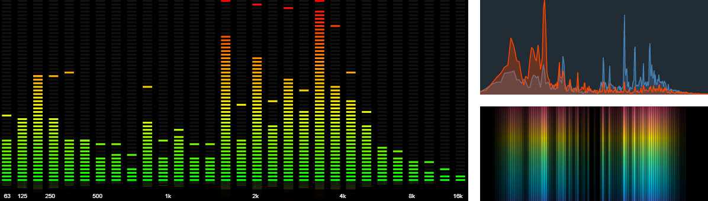](https://audiomotion.dev/demo/)

?> https://audiomotion.dev/demo/

## Live code examples

- [Quick and easy spectrum analyzer](https://codepen.io/hvianna/pen/pobMLNL)
- [Using microphone input](https://codepen.io/hvianna/pen/VwKZgEE)
- [Creating additional effects with `getEnergy()`](https://codepen.io/hvianna/pen/poNmVYo)
- [No canvas example](https://codepen.io/hvianna/pen/ZEKWWJb) (create your own visualization using analyzer data)
- Example integrations with other audio libraries:
  - [Icecast Metadata Player](https://codepen.io/hvianna/pen/YzrgWVe)
  - [Pizzicato](https://codesandbox.io/s/9y6qb)
  - [jPlayer](https://codepen.io/hvianna/pen/dyVrMJX)
- [See more code examples on CodePen](https://codepen.io/collection/ABbbKr)

## Usage

### Node.js project

Install via npm:

```console
npm i audiomotion-analyzer
```

Use ES6 import:

```js
import AudioMotionAnalyzer from 'audiomotion-analyzer';
```

Or CommonJS require:

```js
const { AudioMotionAnalyzer } = require('audioMotion-analyzer');
```

### In the browser using native ES6 module (ESM)

Load from Skypack CDN:

```html
<script type="module">
  import AudioMotionAnalyzer from 'https://cdn.skypack.dev/audiomotion-analyzer?min';
  // your code here
</script>
```

Or download the [latest version](https://github.com/hvianna/audioMotion-analyzer/releases) and copy the `audioMotion-analyzer.js` file from the `src/` folder into your project folder.

### In the browser using global variable

Load from Unpkg CDN:

```html
<script src="https://unpkg.com/audiomotion-analyzer/dist"></script>
<script>
  // available as AudioMotionAnalyzer global
</script>
```


## Constructor

```js
new AudioMotionAnalyzer()
new AudioMotionAnalyzer( container )
new AudioMotionAnalyzer( container, {options} )
new AudioMotionAnalyzer( {options} )
```

Creates a new instance of **audioMotion-analyzer**.

`container` is the DOM element into which the canvas created for the analyzer should be inserted.

If not defined, defaults to `document.body`, unless [`canvas`](#canvas-htmlcanvaselement-object) is defined in the options, in which case its parent element will be considered the container.

`options` must be an [Options object](#options-object).

Usage example:

```js
const audioMotion = new AudioMotionAnalyzer(
	document.getElementById('container'),
	{
		source: document.getElementById('audio')
	}
);
```

This will insert the analyzer canvas inside the *#container* element and start the visualization of audio coming from the *#audio* element.

?> By default, audioMotion will try to use all available container space for the canvas. To prevent it from growing indefinitely, you must either constrain the dimensions of the container via CSS or explicitly define [`height`](#height-number) and/or [`width`](#width-number) properties in the constructor [options](#options-object).

### Options object

Valid properties and default values are shown below.

Properties marked as *constructor only* can only be set in the constructor call, the others can also be set anytime via [`setOptions()`](#setoptions-options-) method or
directly as [properties](#properties) of the audioMotion instance.

options = {<br>
&emsp;&emsp;[alphaBars](#alphabars-boolean): **false**,<br>
&emsp;&emsp;[ansiBands](#ansibands-boolean): **false**,<br>
&emsp;&emsp;[audioCtx](#audioctx-audiocontext-object): *undefined*, // constructor only<br>
&emsp;&emsp;[barSpace](#barspace-number): **0.1**,<br>
&emsp;&emsp;[bgAlpha](#bgalpha-number): **0.7**,<br>
&emsp;&emsp;[canvas](#canvas-htmlcanvaselement-object): *undefined*, // constructor only<br>
&emsp;&emsp;[channelLayout](#channellayout-string): **'single'**,<br>
&emsp;&emsp;[colorMode](#colormode-string): **'gradient'**,<br>
&emsp;&emsp;[connectSpeakers](#connectspeakers-boolean): **true**, // constructor only<br>
&emsp;&emsp;[fadePeaks](#fadepeaks-boolean): **false**,<br>
&emsp;&emsp;[fftSize](#fftsize-number): **8192**,<br>
&emsp;&emsp;[fillAlpha](#fillalpha-number): **1**,<br>
&emsp;&emsp;[frequencyScale](#frequencyscale-string): **'log'**,<br>
&emsp;&emsp;[fsElement](#fselement-htmlelement-object): *undefined*, // constructor only<br>
&emsp;&emsp;[gradient](#gradient-string): **'classic'**,<br>
&emsp;&emsp;[gradientLeft](#gradientleft-string): *undefined*,<br>
&emsp;&emsp;[gradientRight](#gradientright-string): *undefined*,<br>
&emsp;&emsp;[gravity](#gravity-number): **3.8**,<br>
&emsp;&emsp;[height](#height-number): *undefined*,<br>
&emsp;&emsp;[ledBars](#ledbars-boolean): **false**,<br>
&emsp;&emsp;[linearAmplitude](#linearamplitude-boolean): **false**,<br>
&emsp;&emsp;[linearBoost](#linearboost-number): **1**,<br>
&emsp;&emsp;[lineWidth](#linewidth-number): **0**,<br>
&emsp;&emsp;[loRes](#lores-boolean): **false**,<br>
&emsp;&emsp;[lumiBars](#lumibars-boolean): **false**,<br>
&emsp;&emsp;[maxDecibels](#maxdecibels-number): **-25**,<br>
&emsp;&emsp;[maxFPS](#maxfps-number): **0**,<br>
&emsp;&emsp;[maxFreq](#maxfreq-number): **22000**,<br>
&emsp;&emsp;[minDecibels](#mindecibels-number): **-85**,<br>
&emsp;&emsp;[minFreq](#minfreq-number): **20**,<br>
&emsp;&emsp;[mirror](#mirror-number): **0**,<br>
&emsp;&emsp;[mode](#mode-number): **0**,<br>
&emsp;&emsp;[noteLabels](#notelabels-boolean): **false**,<br>
&emsp;&emsp;[onCanvasDraw](#oncanvasdraw-function): *undefined*,<br>
&emsp;&emsp;[onCanvasResize](#oncanvasresize-function): *undefined*,<br>
&emsp;&emsp;[outlineBars](#outlinebars-boolean): **false**,<br>
&emsp;&emsp;[overlay](#overlay-boolean): **false**,<br>
&emsp;&emsp;[peakFadeTime](#peakfadetime-number): **750**,<br>
&emsp;&emsp;[peakHoldTime](#peakholdtime-number): **500**,<br>
&emsp;&emsp;[peakLine](#peakline-boolean): **false**,<br>
&emsp;&emsp;[radial](#radial-boolean): **false**,<br>
&emsp;&emsp;[radialInvert](#radialinvert-boolean): **false**,<br>
&emsp;&emsp;[radius](#radius-number): **0.3**,<br>
&emsp;&emsp;[reflexAlpha](#reflexalpha-number): **0.15**,<br>
&emsp;&emsp;[reflexBright](#reflexbright-number): **1**,<br>
&emsp;&emsp;[reflexFit](#reflexfit-boolean): **true**,<br>
&emsp;&emsp;[reflexRatio](#reflexratio-number): **0**,<br>
&emsp;&emsp;[roundBars](#roundbars-boolean): **false**,<br>
&emsp;&emsp;[showBgColor](#showbgcolor-boolean): **true**,<br>
&emsp;&emsp;[showFPS](#showfps-boolean): **false**,<br>
&emsp;&emsp;[showPeaks](#showpeaks-boolean): **true**,<br>
&emsp;&emsp;[showScaleX](#showscalex-boolean): **true**,<br>
&emsp;&emsp;[showScaleY](#showscaley-boolean): **false**,<br>
&emsp;&emsp;[smoothing](#smoothing-number): **0.5**,<br>
&emsp;&emsp;[source](#source-htmlmediaelement-or-audionode-object): *undefined*, // constructor only<br>
&emsp;&emsp;[spinSpeed](#spinspeed-number): **0**,<br>
&emsp;&emsp;[splitGradient](#splitgradient-boolean): **false**,<br>
&emsp;&emsp;[start](#start-boolean): **true**, // constructor only<br>
&emsp;&emsp;[trueLeds](#trueleds-boolean): **false**,<br>
&emsp;&emsp;[useCanvas](#usecanvas-boolean): **true**,<br>
&emsp;&emsp;[volume](#volume-number): **1**,<br>
&emsp;&emsp;[weightingFilter](#weightingFilter-string): **''**<br>
&emsp;&emsp;[width](#width-number): *undefined*<br>
}

### Constructor-specific options

#### `audioCtx` *AudioContext object*

*Available since v2.0.0*

Allows you to provide an external [*AudioContext*](https://developer.mozilla.org/en-US/docs/Web/API/AudioContext)
for **audioMotion-analyzer**, for connection with other Web Audio nodes or sound-processing modules.

Since version 3.2.0, `audioCtx` will be automatically inferred from the [`source`](#source-htmlmediaelement-or-audionode-object) property if that's an *AudioNode*.

If neither is defined, a new audio context will be created. After instantiation, [`audioCtx`](#audioctx-audiocontext-object-read-only) will be available as a read-only property.

See [this live code](https://codesandbox.io/s/9y6qb) and the [multi-instance demo](/demo/multi.html) for more usage examples.

#### `canvas` *HTMLCanvasElement object*

*Available since v4.4.0*

Allows you to provide an existing [*Canvas*](https://developer.mozilla.org/en-US/docs/Web/API/HTMLCanvasElement) where audioMotion should render its visualizations.

If not defined, a new canvas will be created. After instantiation, you can obtain its reference from the [`canvas`](#canvas-htmlcanvaselement-object-read-only) read-only property.

#### `connectSpeakers` *boolean*

*Available since v3.2.0*

Whether or not to connect the analyzer output to the speakers (technically, the *AudioContext* `destination` node).

Some scenarios where you may want to set this to `false`:

1. when running multiple instances of **audioMotion-analyzer** sharing the same audio input (see the [multi demo](/demo/multi.html)),
only one of them needs to be connected to the speakers, otherwise the volume will be amplified due to multiple outputs;
1. when audio input comes from the microphone and you're not using headphones, to prevent a feedback loop from the speakers;
1. when you're using **audioMotion-analyzer** with an audio player which already outputs sound to the speakers (same reason as 1).

After instantiation, use [`connectOutput()`](#connectoutput-node-) and [`disconnectOutput()`](#disconnectoutput-node-) to connect or disconnect the output from the speakers (or other nodes).

See also [`connectedTo`](#connectedto-array-read-only).

Defaults to **true**.

#### `fsElement` *HTMLElement object*

*Available since v3.4.0*

HTML element affected by the [`toggleFullscreen()`](#togglefullscreen) method.

If not defined, defaults to the [`canvas`](#canvas-htmlcanvaselement-object-read-only).
**Set it to a container `<div>` to keep additional interface elements available in fullscreen mode.**

See the [overlay demo](/demo/overlay.html) or [this pen](https://codepen.io/hvianna/pen/LYREBYQ) for usage examples.

After instantiation, [`fsElement`](#fselement-htmlelement-object-read-only) is available as a read-only property.

#### `source` *HTMLMediaElement or AudioNode object*

If `source` is specified, connects an [*HTMLMediaElement*](https://developer.mozilla.org/en-US/docs/Web/API/HTMLMediaElement) (`<audio>` or `<video>` HTML element)
or [*AudioNode*](https://developer.mozilla.org/en-US/docs/Web/API/AudioNode) object to the analyzer.

At least one audio source is required for the analyzer to work. You can also connect audio sources after instantiation, using the [`connectInput()`](#connectinput-source-) method.

#### `start` *boolean*

If `start: false` is specified, the analyzer will be created stopped. You can then start it with the [`start()`](#start) or [`toggleAnalyzer()`](#toggleanalyzer-boolean-) methods.

Defaults to **true**, so the analyzer will start running right after initialization.

## Properties

### `alphaBars` *boolean*

*Available since v3.6.0*

When set to *true* each bar's amplitude affects its opacity, i.e., higher bars are rendered more opaque while shorter bars are more transparent.

This is similar to the [`lumiBars`](#lumibars-boolean) effect, but bars' amplitudes are preserved and it also works on **Discrete** [mode](#mode-number) and [radial](#radial-boolean) spectrum.

For effect priority when combined with other settings, see [`isAlphaBars`](#isalphabars-boolean-read-only).

Defaults to **false**.

!> [See related known issue](#alphabars-and-fillalpha-wont-work-with-radial-on-firefox)

### `ansiBands` *boolean*

*Available since v4.0.0*

When set to *true*, ANSI/IEC preferred frequencies are used to generate the bands for **octave bands** modes (see [`mode`](#mode-number)).
The preferred base-10 scale is used to compute the center and bandedge frequencies, as specified in the [ANSI S1.11-2004 standard](https://archive.org/details/gov.law.ansi.s1.11.2004).

When *false*, bands are based on the [equal-tempered scale](http://hyperphysics.phy-astr.gsu.edu/hbase/Music/et.html), so that in 1/12 octave bands
the center of each band is perfectly tuned to a musical note.

ansiBands | bands standard | octaves' center frequencies
----------|----------------|----------------------------
false     | Equal temperament (A-440 Hz) | 
true      | ANSI S1.11-2004 | 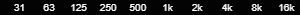

Defaults to **false**.

### `audioCtx` *AudioContext object* *(Read only)*

[*AudioContext*](https://developer.mozilla.org/en-US/docs/Web/API/AudioContext) used by **audioMotion-analyzer**.

Use this object to create additional audio sources to be connected to the analyzer, like oscillator nodes, gain nodes and media streams.

The code fragment below creates an oscillator and a gain node using audioMotion's *AudioContext*, and then connects them to the analyzer:

```js
const audioMotion = new AudioMotionAnalyzer( document.getElementById('container') ),
      audioCtx    = audioMotion.audioCtx,
      oscillator  = audioCtx.createOscillator(),
      gainNode    = audioCtx.createGain();

oscillator.frequency.value = 440; // set 440Hz frequency
oscillator.connect( gainNode ); // connect oscillator -> gainNode

gainNode.gain.value = .5; // set volume to 50%
audioMotion.connectInput( gainNode ); // connect gainNode -> audioMotion

oscillator.start(); // play tone
```

You can provide your own *AudioContext* via the [`audioCtx`](#audioctx-audiocontext-object) property in the [constructor](#constructor) options.

See also the [fluid demo](/demo/fluid.html) and the [multi-instance demo](/demo/multi.html) for more usage examples.

### `barSpace` *number*

*Available since v2.0.0*

Customize the spacing between bars in frequency bands modes (see [`mode`](#mode-number)).

Use a value between 0 and 1 for spacing proportional to the band width. Values >= 1 will be considered as a literal number of pixels.

For example, `barSpace = 0.5` will use half the width available to each band for spacing and half for the bar itself.
On the other hand, `barSpace = 2` will set a fixed spacing of 2 pixels, independent of the width of bars.
Prefer proportional spacing to obtain consistent results among different resolutions and screen sizes.

`barSpace = 0` will effectively show contiguous bars, except when [`ledBars`](#ledbars-boolean) is *true*, in which case a minimum spacing is enforced
(this can be customized via [`setLedParams()`](#setledparams-params-) method).

Defaults to **0.1**.

### `bgAlpha` *number*

*Available since v2.2.0*

Controls the opacity of the background, when [`overlay`](#overlay-boolean) and [`showBgColor`](#showbgcolor-boolean) are both set to *true*.

It must be a number between 0 (completely transparent) and 1 (completely opaque).

Defaults to **0.7**.

### `canvas` *HTMLCanvasElement object* *(Read only)*

[*Canvas*](https://developer.mozilla.org/en-US/docs/Web/API/HTMLCanvasElement) element where audioMotion renders its visualizations.

See also the [`canvas`](#canvas-htmlcanvaselement-object) constructor option.

### `canvasCtx` *CanvasRenderingContext2D object* *(Read only)*

[2D rendering context](https://developer.mozilla.org/en-US/docs/Web/API/CanvasRenderingContext2D) used for drawing in audioMotion's [`canvas`](#canvas-htmlcanvaselement-object-read-only).

### `channelLayout` *string*

*Available since v4.0.0*

Defines the number and layout of analyzer channels.

channelLayout     | Description | Note
------------------|-------------|------
'single'          | Single channel analyzer, representing the combined output of both left and right channels.
'dual-combined'   | Dual channel analyzer, both channels overlaid. Works best with semi-transparent **Graph** [`mode`](#mode-number) or [`outlineBars`](#outlinebars-boolean).
'dual-horizontal' | Dual channel, side by side - see [`mirror`](#mirror-number) for additional layout options. | *since v4.3.0*
'dual-vertical'   | Dual channel, left channel at the top half of the canvas and right channel at the bottom.

!> When a *dual* layout is selected, any mono (single channel) audio source connected to the analyzer will output sound only from the left speaker,
unless a stereo source is simultaneously connected to the analyzer, which will force the mono input to be upmixed to stereo.

See also [`gradientLeft`](#gradientleft-string), [`gradientRight`](#gradientright-string) and [`splitGradient`](#splitgradient-boolean).

### `colorMode` *string*

*Available since v4.1.0*

Selects the desired mode for coloring the analyzer bars. This property has no effect in **Graph** [`mode`](#mode-number).

colorMode   | Description | Preview ('prism' gradient)
------------|-------------|----------------------------
'gradient'  | Analyzer bars are painted with the currently selected [`gradient`](#gradient-string). This is the default behavior. | 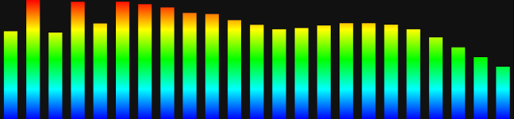
'bar-index' | Each analyzer bar is painted with a **single color** from the selected gradient's *colorStops*, starting with the first color applied to the first bar, and so on, cycling through the available colorStops. | 
'bar-level' | Colors from the selected gradient are used to paint each bar, according to its current level (amplitude). | 

See also [`registerGradient()`](#registergradient-name-options-).

Defaults to **'gradient'**.

### `connectedSources` *array* *(Read only)*

*Available since v3.0.0*

An array of *AudioNode* objects connected to the analyzer **input** via the [`source`](#source-htmlmediaelement-or-audionode-object) constructor option, or by using the [`connectInput()`](#connectinput-source-) method.

### `connectedTo` *array* *(Read only)*

*Available since v3.2.0*

An array of *AudioNode* objects to which the analyzer **output** is connected.

By default, **audioMotion-analyzer** is connected to the *AudioContext* `destination` node (the speakers) upon instantiation, unless you set [`connectSpeakers: false`](#connectspeakers-boolean) in the constructor options.

See also [`connectOutput()`](#connectoutput-node-).

### `fadePeaks` *boolean*

*Available since v4.5.0*

When *true*, peaks fade out instead of falling down. It has no effect when [`peakLine`](#peakline-boolean) is active.

Fade time can be customized via [`peakFadeTime`](#peakfadetime-number).

See also [`peakHoldTime`](#peakholdtime-number) and [`showPeaks`](#showpeaks-boolean).

Defaults to **false**.

### `fftSize` *number*

Number of samples used for the FFT performed by the [*AnalyzerNode*](https://developer.mozilla.org/en-US/docs/Web/API/AnalyserNode).
It must be a power of 2 between 32 and 32768, so valid values are: 32, 64, 128, 256, 512, 1024, 2048, 4096, 8192, 16384, and 32768.

Higher values provide more detail in the frequency domain, but less detail in the time domain (slower response), so you may need to adjust [`smoothing`](#smoothing-number) accordingly.

Defaults to **8192**.

### `fillAlpha` *number*

*Available since v2.0.0*

Opacity of the area fill in [Graph mode](#mode-number), or inner fill of bars in [frequency bands modes](#mode-number) when [`outlineBars`](#outlinebars-boolean) is *true*.

It must be a number between 0 (completely transparent) and 1 (completely opaque).

Please note that the line stroke (when [`lineWidth`](#linewidth-number) > 0) is always drawn at full opacity, regardless of the `fillAlpha` value.

Also, for [frequency bands modes](#mode-number), [`alphaBars`](#alphabars-boolean) set to *true* takes precedence over `fillAlpha`.

Defaults to **1**.

!> [See related known issue](#alphabars-and-fillalpha-wont-work-with-radial-on-firefox)

### `fps` *number* *(Read only)*

Current frame rate.

### `frequencyScale` *string*

*Available since v4.0.0*

Scale used to represent frequencies in the horizontal axis.

frequencyScale | description | scale preview (10Hz - 24kHz range)
---------------|-------------|-----------------------------------
'bark' | Bark scale | 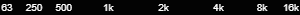
'linear' | Linear scale | 
'log' | Logarithmic scale | 
'mel' | Mel scale | 

Logarithmic scale allows visualization of proper **octave bands** (see [`mode`](#mode-number)) and it's also recommended when using [`noteLabels`](#notelabels-boolean).

[*Bark*](https://en.wikipedia.org/wiki/Bark_scale) and [*Mel*](https://en.wikipedia.org/wiki/Mel_scale) are perceptual pitch scales, which may provide better visualization of mid-range frequencies, when compared to log or linear scales.

Defaults to **'log'**.

### `fsElement` *HTMLElement object* *(Read only)*

*Available since v3.4.0*

HTML element affected by the [`toggleFullscreen()`](#togglefullscreen) method.

See [`fsElement`](#fselement-htmlelement-object) in the constructor options context for more information.

### `fsHeight` *number* *(Read only)*
### `fsWidth` *number* *(Read only)*

Canvas dimensions used during fullscreen mode. These take the current pixel ratio into account and will change accordingly when [low-resolution mode](#lores-boolean) is set.

### `gradient` *string*

Name of the color gradient used for analyzer graphs.

It must be a built-in or registered gradient name (see [`registerGradient()`](#registergradient-name-options-)).

`gradient` sets the gradient for both analyzer channels, but its read value represents only the gradient on the left (or single) channel.

When using a dual [`channelLayout`](#channellayout-string), use [`gradientLeft`](#gradientleft-string) and [`gradientRight`](#gradientright-string) to set/read the gradient on each channel individually.

Built-in gradients are shown below:

gradient    | preview
------------|---------
'classic'   | 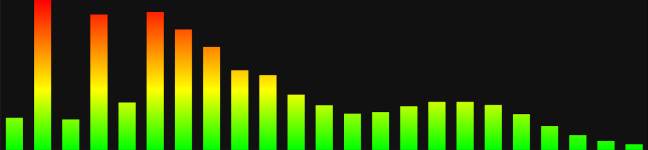
'orangered' | 
'prism'     | 
'rainbow'   | 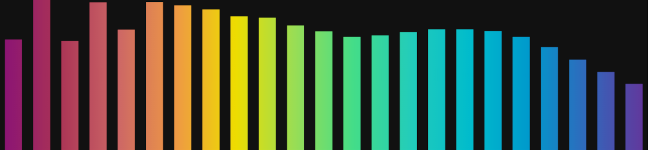
'steelblue' | 

See also [`splitGradient`](#splitgradient-boolean).

Defaults to **'classic'**.

### `gradientLeft` *string*
### `gradientRight` *string*

*Available since v4.0.0*

Select gradients for the left and right analyzer channels independently, for use with a dual [`channelLayout`](#channellayout-string).

**_Single_** channel layout will use the gradient selected by `gradientLeft`.

For **_dual-combined_** channel layout or [`radial`](#radial-boolean) spectrum, only the background color defined by `gradientLeft` will be applied when [`showBgColor`](#showbgcolor-boolean) is *true*.

See also [`gradient`](#gradient-string) and [`splitGradient`](#splitgradient-boolean).

### `gravity` *number*

*Available since v4.5.0*

Customize the acceleration of falling peaks.

It must be a number **greater than zero,** representing _thousands of pixels per second squared_. Invalid values are ignored and no error is thrown.

With the default value and analyzer height of 1080px, a peak at maximum amplitude takes approximately 750ms to fall to zero.

You can use the [peak drop analysis tool](/tools/peak-drop.html) to see the decay curve for different values of gravity.

See also [`peakHoldTime`](#peakholdtime-number) and [`showPeaks`](#showpeaks-boolean).

Defaults to **3.8**.

### `height` *number*
### `width` *number*

Nominal dimensions of the analyzer.

Setting one or both properties to **_undefined_** (default) will trigger the fluid/responsive behavior and the analyzer will try to adjust to the container's height and/or width.
In that case, it's important that you constrain the dimensions of the container via CSS to prevent the canvas from growing indefinitely.

You can set both values at once using the [`setCanvasSize()`](#setcanvassize-width-height-) method.

See also [`onCanvasResize`](#oncanvasresize-function).

?> The actual dimensions of the canvas may differ from these values, depending on the device's [pixelRatio](#pixelratio-number-read-only), the [`loRes`](#lores-boolean) setting and while in fullscreen. For the actual pixel values, read `height` and `width` directly from the [`canvas`](#canvas-htmlcanvaselement-object-read-only) object.

### `isAlphaBars` *boolean* *(Read only)*

*Available since v3.6.0*

***true*** when alpha bars are effectively being displayed, i.e., [`alphaBars`](#alphabars-boolean) is set to *true* and [`mode`](#mode-number) is set to discrete frequencies
or one of the frequency bands modes, in which case [`lumiBars`](#lumibars-boolean) must be set to *false* or [`radial`](#radial-boolean) must be set to *true*.

### `isBandsMode` *boolean* *(Read only)*

*Available since v4.0.0*

***true*** when [`mode`](#mode-number) is set to one of the bands mode (modes 1 to 8).

See also [`isOctaveBands`](#isoctavebands-boolean-read-only).

### `isDestroyed` *boolean* *(Read only)*

*Available since v4.2.0*

***true*** when the object has been destroyed with [`destroy()`](#destroy).

### `isFullscreen` *boolean* *(Read only)*

***true*** when the analyzer is being displayed in fullscreen, or ***false*** otherwise.

See [`toggleFullscreen()`](#togglefullscreen).

### `isLedBars` *boolean* *(Read only)*

*Available since v3.6.0; formerly `isLedDisplay` (since v3.0.0)*

***true*** when LED bars are effectively being displayed, i.e., [`isBandsMode`](#isbandsmode-boolean-read-only) is *true*, [`ledBars`](#ledBars-boolean) is set to *true* and [`radial`](#radial-boolean) is set to *false*.

### `isLumiBars` *boolean* *(Read only)*

*Available since v3.0.0*

***true*** when luminance bars are effectively being displayed, i.e., [`isBandsMode`](#isbandsmode-boolean-read-only) is *true*, [`lumiBars`](#lumibars-boolean) is set to *true* and [`radial`](#radial-boolean) is set to *false*.

### `isOctaveBands` *boolean* *(Read only)*

*Available since v3.0.0*

***true*** when [`isBandsMode`](#isbandsmode-boolean-read-only) is *true* and [`frequencyScale`](#frequencyscale-string) is set to *'log'*.

### `isOn` *boolean* *(Read only)*

***true*** if the analyzer process is running, or *false* if it's stopped.

See [`start()`](#start), [`stop()`](#stop) and [`toggleAnalyzer()`](#toggleanalyzer-boolean-).

### `isOutlineBars` *boolean* *(Read only)*

*Available since v3.6.0*

***true*** when outlined bars are effectively being displayed, i.e., [`isBandsMode`](#isbandsmode-boolean-read-only) is *true*, [`outlineBars`](#outlinebars-boolean) is set to *true*
and both [`ledBars`](#ledbars-boolean) and [`lumiBars`](#lumibars-boolean) are set to *false*, or [`radial`](#radial-boolean) is set to *true*.

### `isRoundBars` *boolean* *(Read only)*

*Available since v4.1.0*

***true*** when round bars are effectively being displayed, i.e., [`isBandsMode`](#isbandsmode-boolean-read-only) is *true*, [`roundBars`](#roundbars-boolean) is set to *true*
and [`ledBars`](#ledbars-boolean) and [`lumiBars`](#lumibars-boolean) are both set to *false*.

### `ledBars` *boolean*

*Available since v3.6.0; formerly `showLeds` (since v1.0.0)*

*true* to activate the LED bars effect for frequency bands modes (see [`mode`](#mode-number)).

This effect can be customized via [`setLedParams()`](#setledparams-params-) method.

For effect priority when combined with other settings, see [`isLedBars`](#isledbars-boolean-read-only).

See also [`trueLeds`](#trueleds-boolean).

Defaults to **false**.

### `linearAmplitude` *boolean*

*Available since v4.0.0*

When set to *true*, spectrum amplitudes are represented in linear scale instead of decibels (logarithmic).

This may improve the visualization of predominant tones, especially at higher frequencies, but it will make the entire spectrum look much quieter.

See also [`linearBoost`](#linearboost-number).

Defaults to **false**.

### `linearBoost` *number*

*Available since v4.0.0*

Performs an *n*th-root operation to amplify low energy values when using linear scale for the amplitude.

It should be a number >= 1, while 1 means no boosting. Only effective when [`linearAmplitude`](#linearamplitude-boolean) is set to *true*.

Defaults to **1**.

### `lineWidth` *number*

*Available since v2.0.0*

Line width for [Graph mode](#mode-number), or outline stroke in [frequency bands modes](#mode-number) when [`outlineBars`](#outlinebars-boolean) is *true*.

For the line to be distinguishable, set also [`fillAlpha`](#fillalpha-number) < 1.

Defaults to **0**.

### `loRes` *boolean*

*true* for low resolution mode. Defaults to **false**.

Low resolution mode halves the effective pixel ratio, resulting in four times less pixels to render. This may improve performance significantly, especially in 4K+ monitors.

?> If you want to allow users to interactively toggle low resolution mode, you may need to set a fixed size for the canvas via CSS, like so:

```css
canvas {
    display: block;
    width: 100%;
}
```

This will prevent the canvas size from changing, when switching the low resolution mode on and off.

### `lumiBars` *boolean*

*Available since v1.1.0*

This is only effective for frequency bands modes (see [`mode`](#mode-number)).

When set to *true* all analyzer bars will be displayed at full height with varying luminance (opacity, actually) instead.

`lumiBars` takes precedence over [`alphaBars`](#alphabars-boolean) and [`outlineBars`](#outlinebars-boolean), except on [`radial`](#radial-boolean) spectrum.

For effect priority when combined with other settings, see [`isLumiBars`](#islumibars-boolean-read-only).

Defaults to **false**.

### `maxDecibels` *number*
### `minDecibels` *number*

Highest and lowest decibel values represented in the Y-axis of the analyzer. The loudest volume possible is **0**.

You can set both values at once using the [`setSensitivity()`](#setsensitivity-mindecibels-maxdecibels-) method.

For more info, see [AnalyserNode.minDecibels](https://developer.mozilla.org/en-US/docs/Web/API/AnalyserNode/minDecibels).

*minDecibels* defaults to **-85** and *maxDecibels* defaults to **-25**.

### `maxFPS` *number*

*Available since v4.2.0*

Sets the maximum desired animation frame rate. This can help reducing CPU usage, especially on high refresh rate monitors.

It must be a number, indicating frames per second. A value of **0** means the animation will run at the highest frame rate possible.

Defaults to **0**.

### `maxFreq` *number*
### `minFreq` *number*

Highest and lowest frequencies represented in the X-axis of the analyzer. Values in Hertz.

The minimum allowed value is **1**. Trying to set a lower value will throw an `ERR_FREQUENCY_TOO_LOW` [error](#custom-errors).

The maximum allowed value is half the sampling rate ([`audioCtx.sampleRate`](#audioctx-audiocontext-object-read-only)), known as the [Nyquist frequency](https://en.wikipedia.org/wiki/Nyquist_frequency).
Values higher than that will be capped.

It is preferable to use the [`setFreqRange()`](#setfreqrange-minfreq-maxfreq-) method and set both values at once, to prevent `minFreq` being higher than the current `maxFreq` or vice-versa at a given moment.

*minFreq* defaults to **20** and *maxFreq* defaults to **22000**.

### `mirror` *number*

*Available since v3.3.0*

When [`channelLayout`](#channellayout-string) is **dual-horizontal**, this property controls the orientation of the X-axis (frequencies) on both channels.

For other layouts, it horizontally mirrors the spectrum image to the left or right side.

Valid values are:

mirror | Description
:-----:|-------------
-1     | Low frequencies meet at the center of the screen (mirror left)
0      | No mirror effect or change to axis orientation (default)
1      | High frequencies meet at the center of the screen (mirror right)

**Note:** On [`radial`](#radial-boolean) spectrum with channel layouts other than *dual-horizontal*, both `1` and `-1` have the same effect.

Defaults to **0**.

### `mode` *number*

Visualization mode.

mode | description | notes
----:|:-----------:|------
0 | Discrete frequencies | *default*
1 | 1/24th octave bands or 240 bands | *use 'log' `frequencyScale` for octave bands*
2 | 1/12th octave bands or 120 bands | *use 'log' `frequencyScale` for octave bands*
3 | 1/8th octave bands or 80 bands | *use 'log' `frequencyScale` for octave bands*
4 | 1/6th octave bands or 60 bands | *use 'log' `frequencyScale` for octave bands*
5 | 1/4th octave bands or 40 bands | *use 'log' `frequencyScale` for octave bands*
6 | 1/3rd octave bands or 30 bands | *use 'log' `frequencyScale` for octave bands*
7 | Half octave bands or 20 bands | *use 'log' `frequencyScale` for octave bands*
8 | Full octave bands or 10 bands | *use 'log' `frequencyScale` for octave bands*
9 | *(not valid)* | *reserved*
10 | Graph | *since v1.1.0*

+ **Mode 0** provides the highest resolution, allowing you to visualize individual frequencies as provided by the [FFT](https://en.wikipedia.org/wiki/Fast_Fourier_transform) computation;
+ **Modes 1 - 8** divide the frequency spectrum in bands; when using the default **logarithmic** [`frequencyScale`](#frequencyscale-string), each band represents the *n*th part of an octave; otherwise, a fixed number of bands is used for each mode;
+ **Mode 10** uses the discrete FFT data points to draw a continuous line and/or a filled area graph (see [`fillAlpha`](#fillalpha-number) and [`lineWidth`](#linewidth-number) properties).

See also [`ansiBands`](#ansibands-boolean).

Defaults to **0**.

### `noteLabels` *boolean*

*Available since v4.0.0*

When set to *true* displays musical note labels instead of frequency values, in the X axis (when [`showScaleX`](#showscalex-boolean) is also set to *true*).

For best visualization in [octave bands modes](#mode-number), make sure [`frequencyScale`](#frequencyscale-string) is set to *'log'*
and [`ansiBands`](#ansibands-boolean) is set to *false*, so bands are tuned to the equal temperament musical scale.

Defaults to **false**.

### `outlineBars` *boolean*

*Available since v3.6.0*

When *true* and [`mode`](#mode-number) is set to one of the **bands** modes, analyzer bars are rendered outlined, with customizable [`fillAlpha`](#fillalpha-number) and [`lineWidth`](#linewidth-number).

For effect priority when combined with other settings, see [`isOutlineBars`](#isoutlinebars-boolean-read-only).

Defaults to **false**.

### `overlay` *boolean*

*Available since v2.2.0*

Allows the analyzer to be displayed over other content, by making the canvas background transparent, when set to *true*.

When [`showBgColor`](#showbgcolor-boolean) is also *true*, [`bgAlpha`](#bgalpha-number) controls the background opacity.

Defaults to **false**.

?> In order to keep elements other than the canvas visible in fullscreen, you'll need to set the [`fsElement`](#fselement-htmlelement-object) property in the [constructor](#constructor) options.

### `peakFadeTime` *number*

*Available since v4.5.0*

Time in milliseconds for peaks to completely fade out, when [`fadePeaks`](#fadepeaks-boolean) is active.

It must be a number greater than or equal to zero. Invalid values are ignored and no error is thrown.

See also [`peakHoldTime`](#peakholdtime-number) and [`showPeaks`](#showpeaks-boolean).

Defaults to **750**.

### `peakHoldTime` *number*

*Available since v4.5.0*

Time in milliseconds for peaks to hold their value before they begin to fall or fade.

It must be a number greater than or equal to zero. Invalid values are ignored and no error is thrown.

See also [`fadePeaks`](#fadepeaks-boolean), [`gravity`](#gravity-number), [`peakFadeTime`](#peakfadetime-number) and [`showPeaks`](#showpeaks-boolean).

Defaults to **500**.

### `peakLine` *boolean*

*Available since v4.2.0*

When *true* and [`mode`](#mode-number) is *10* (**Graph**) and [`showPeaks`](#showpeaks-boolean) is *true*, peaks are connected into a continuous line. It has no effect in other modes.

Defaults to **false**.

### `pixelRatio` *number* *(Read only)*

Current [devicePixelRatio](https://developer.mozilla.org/en-US/docs/Web/API/Window/devicePixelRatio).
This is usually **1** for standard displays and **2** for retina / Hi-DPI screens.

When [`loRes`](#lores-boolean) is *true*, the value of `pixelRatio` is halved, i.e. **0.5** for standard displays and **1** for retina / Hi-DPI.

You can refer to this value to adjust any additional drawings done in the canvas (via [callback function](#oncanvasdraw-function)).

### `radial` *boolean*

*Available since v2.4.0*

When *true*, the spectrum analyzer is rendered in a circular shape, with radial frequency bars spreading from its center.

In radial view, [`ledBars`](#ledbars-boolean) and [`lumiBars`](#lumibars-boolean) effects are disabled.

When [`channelLayout`](#channellayout-string) is set to *'dual-vertical'*, graphs for the right channel are rendered towards the center of the screen.

See also [`radialInvert`](#radialinvert-boolean), [`radius`](#radius-number) and [`spinSpeed`](#spinspeed-number).

Defaults to **false**.

!> [See related known issue](#alphabars-and-fillalpha-wont-work-with-radial-on-firefox)

### `radialInvert` *boolean*

*Available since v4.4.0*

When set to *true* (and [`radial`](#radial-boolean) is also *true*) creates a radial spectrum with maximum size and bars growing towards the center of the screen.

This property has no effect when [`channelLayout`](#channellayout-string) is set to *'dual-vertical'*.

See also [`radius`](#radius-number).

Defaults to **false**.

### `radius` *number*

*Available since v4.4.0*

Defines the internal radius of [`radial`](#radial-boolean) spectrum. It should be a number between **0** and **1**.

This property has no effect when [`channelLayout`](#channellayout-string) is set to *'dual-vertical'*.

When [`radialInvert`](#radialinvert-boolean) is *true*, this property controls how close to the center of the screen the bars can get.

Defaults to **0.3**.

### `reflexAlpha` *number*

*Available since v2.1.0*

Reflection opacity (when [`reflexRatio`](#reflexratio-number) > 0).

It must be a number between 0 (completely transparent) and 1 (completely opaque).

Defaults to **0.15**.

### `reflexBright` *number*

*Available since v2.3.0*

Reflection brightness (when [`reflexRatio`](#reflexratio-number) > 0).

It must be a number. Values below 1 darken the reflection and above 1 make it brighter.
A value of 0 will render the reflected image completely black, while a value of 1 will preserve the original brightness.

Defaults to **1**.

!> [See related known issue](#reflexbright-wont-work-on-some-browsers)

### `reflexFit` *boolean*

*Available since v2.1.0*

When *true*, the reflection will be adjusted (stretched or shrinked) to fit the canvas. If set to *false* the reflected image may be cut at the bottom (when [`reflexRatio`](#reflexratio-number) < 0.5) or not fill the entire canvas (when [`reflexRatio`](#reflexratio-number) > 0.5).

Defaults to **true**.

### `reflexRatio` *number*

*Available since v2.1.0*

Percentage of canvas height used for reflection. It must be a number greater than or equal to 0, and less than 1. Trying to set a value out of this range will throw an `ERR_REFLEX_OUT_OF_RANGE` [error](#custom-errors).

For a perfect mirrored effect, set `reflexRatio` to 0.5 and both [`reflexAlpha`](#reflexalpha-number) and [`reflexBright`](#reflexbright-number) to 1.

This has no effect when [`lumiBars`](#lumibars-boolean) is *true*.

Defaults to **0** (no reflection).

### `roundBars` *boolean*

*Available since v4.1.0*

When *true* and [`mode`](#mode-number) is set to one of the **bands** modes, analyzer bars are rendered with rounded corners at the top.

In [`radial`](#radial-boolean) view this makes the top and bottom of bars to follow the curvatures of the outer and inner circles, respectivelly, although the effect
can be barely noticeable with a band count greater than 20 (half-octave bands).

This has no effect when [`ledBars`](#ledbars-boolean) or [`lumiBars`](#lumibars-boolean) are set to *true*.

See also [`isRoundBars`](#isroundbars-boolean-read-only).

Defaults to **false**.

### `showBgColor` *boolean*

Determines whether the canvas background should be painted.

If ***true***, the background color defined by the current gradient will be used.
Opacity can be adjusted via [`bgAlpha`](#bgalpha-number) property, when [`overlay`](#overlay-boolean) is ***true***.

If ***false***, the canvas background will be painted black when [`overlay`](#overlay-boolean) is ***false***,
or transparent when [`overlay`](#overlay-boolean) is ***true***.

See also [`registerGradient()`](#registergradient-name-options-).

Defaults to **true**.

?> Please note that when [`overlay`](#overlay-boolean) is ***false*** and [`ledBars`](#ledbars-boolean) is ***true***, the background color will always be black,
and setting `showBgColor` to ***true*** will make the "unlit" LEDs visible instead.

### `showFPS` *boolean*

*true* to display the current frame rate. Defaults to **false**.

### `showPeaks` *boolean*

*true* to show amplitude peaks.

See also [`gravity`](#gravity-number), [`peakFadeTime`](#peakfadetime-number), [`peakHoldTime`](#peakholdtime-number) and [`peakLine`](#peakline-boolean).

Defaults to **true**.

### `showScaleX` *boolean*

*Available since v3.0.0; formerly `showScale` (since v1.0.0)*

*true* to display scale labels on the X axis.

See also [`noteLabels`](#notelabels-boolean).

Defaults to **true**.

### `showScaleY` *boolean*

*Available since v2.4.0*

*true* to display the level/amplitude scale on the Y axis.

This option has no effect when [`radial`](#radial-boolean) or [`lumiBars`](#lumibars-boolean) are set to *true*.

When [`linearAmplitude`](#linearamplitude-boolean) is set to *false* (default), labels are shown in decibels (dB);
otherwise, values represent a percentage (0-100%) of the maximum amplitude.

See also [`minDecibels`](#mindecibels-number) and [`maxDecibels`](#maxdecibels-number).

Defaults to **false**.

### `smoothing` *number*

Sets the analyzer's [smoothingTimeConstant](https://developer.mozilla.org/en-US/docs/Web/API/AnalyserNode/smoothingTimeConstant).

It must be a number between 0 and 1. Lower values make the analyzer respond faster to changes.

Defaults to **0.5**.

### `spinSpeed` *number*

*Available since v2.4.0*

When [`radial`](#radial-boolean) is *true*, this property defines the analyzer rotation speed, in revolutions per minute.

Positive values will make the analyzer rotate clockwise, while negative values will make it rotate counterclockwise. A value of 0 results in no rotation.

Defaults to **0**.

### `splitGradient` *boolean*

*Available since v3.0.0*

When set to *true* and [`channelLayout`](#channellayout-string) is **_dual-vertical_**, the gradient will be split between channels.

When *false*, both channels will use the full gradient. The effect is illustrated below, using the *'classic'* gradient.

| splitGradient: *false* | splitGradient: *true* |
|:--:|:--:|
| 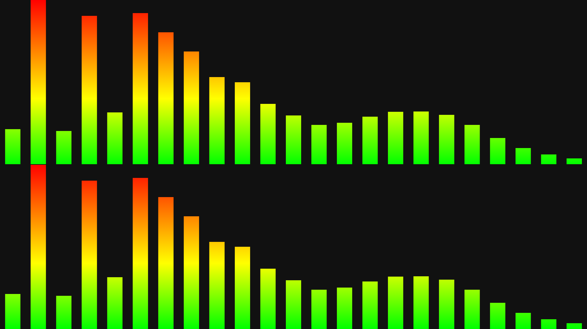 | 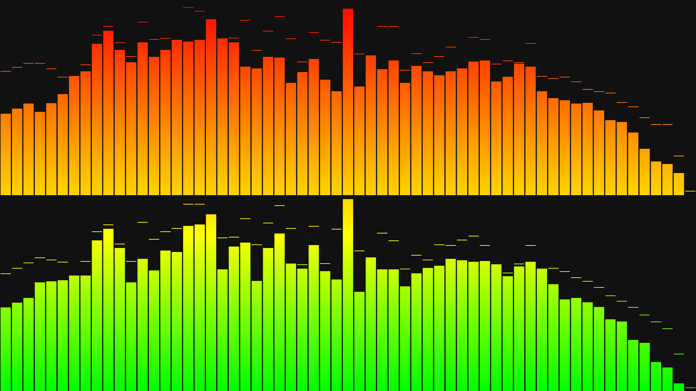 |

This option has no effect on horizontal gradients, except on [`radial`](#radial-boolean) spectrum - see note in [`registerGradient()`](#registergradient-name-options-).

Defaults to **false**.

### `stereo` **(DEPRECATED)** *boolean*

**This property will be removed in version 5** - Use [`channelLayout`](#channellayout-string) instead.

### `trueLeds` *boolean*

*Available since v4.1.0*

When set to *true*, LEDs are painted with individual colors from the current gradient, instead of using the gradient itself.

The effect is illustrated below, using the *'classic'* gradient.

| trueLeds: *false* | trueLeds: *true* |
|:--:|:--:|
| 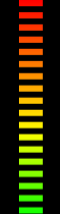 | 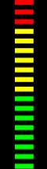 |

The threshold for each color can be adjusted via the `level` property when registering a gradient. See [`registerGradient()`](#registergradient-name-options-).

This option is only effective for frequency bands [modes](#mode-number), when [`ledBars`](#ledbars-boolean) is *true* and [`colorMode`](#colormode-string) is set to *'gradient'*.

Defaults to **false**.

### `useCanvas` *boolean*

*Available since v3.5.0*

When set to *false*, analyzer graphics are not rendered to the [`canvas`](#canvas-htmlcanvaselement-object-read-only).
Setting it to *false* in the [**constructor**](#constructor) options also prevents the canvas from being added to the document/container.

Please note that the analyzer processing runs regardless of the value of `useCanvas` and any callback defined for [`onCanvasDraw`](#oncanvasdraw-function)
will still be triggered on every animation frame, so you can use the [`getBars()`](#getbars) method to create your own visualizations.

If you want to completely stop the analyzer's data processing, see [`stop()`](#stop).

Defaults to **true**.

### `volume` *number*

*Available since v3.0.0*

Read or set the output volume.

A value of **0** (zero) will mute the sound output, while a value of **1** will keep the same input volume.
Higher values can be used to amplify the input, but it may cause distortion.

Please note that changing the audio element volume directly will affect the amplitude of analyzer graphs, while this property does not.

Defaults to **1**.

### `weightingFilter` *string*

*Available since v4.0.0*

[Weighting filter](https://en.wikipedia.org/wiki/Weighting_filter) applied to frequency data for spectrum visualization.

?> Selecting a weighting filter **does NOT** affect the audio output.

Each filter applies a different curve of gain/attenuation to specific frequency ranges, but the general idea is to adjust the
visualization of frequencies to which the human ear is more or less sensitive.

Refer to the [weighting filters viewer tool](/tools/weighting-filters.html) for response tables and an interactive version of the curves graph seen below.

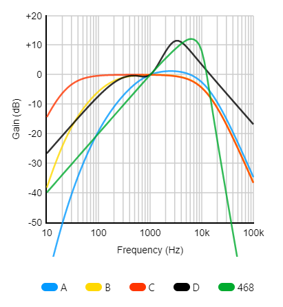

weightingFilter | description
------|------------------------------
'' (empty string) | No weighting applied (default)
'A'   | A-weighting
'B'   | B-weighting
'C'   | C-weighting
'D'   | D-weighting
'468' | ITU-R 468 weighting

Defaults to **''**.


## Static properties

### `AudioMotionAnalyzer.version` *string* *(Read only)*

*Available since v3.0.0*

Returns the version of the **audioMotion-analyzer** package.

Since this is a static property, you should always access it as `AudioMotionAnalyzer.version` - this allows you to check the package version even before instantiating your object.


## Callback functions

### `onCanvasDraw` *function*

If defined, this function will be called after **audioMotion-analyzer** finishes rendering each animation frame.

The callback function is passed two arguments: an *AudioMotionAnalyzer* object, and an object with the following properties:
- `timestamp`, a [*DOMHighResTimeStamp*](https://developer.mozilla.org/en-US/docs/Web/API/DOMHighResTimeStamp)
which indicates the elapsed time in milliseconds since the analyzer started running;
- `canvasGradients`, an array of [*CanvasGradient*](https://developer.mozilla.org/en-US/docs/Web/API/CanvasGradient])
objects currently in use on the left (or single) and right analyzer channels.

The canvas properties `fillStyle` and `strokeStyle` will be set to the left/single channel gradient before the function is called.

Usage example:

```js
const audioMotion = new AudioMotionAnalyzer(
    document.getElementById('container'),
    {
        source: document.getElementById('audio'),
        onCanvasDraw: drawCallback
    }
);

function drawCallback( instance, info ) {
    const baseSize  = ( instance.isFullscreen ? 40 : 20 ) * instance.pixelRatio,
          canvas    = instance.canvas,
          centerX   = canvas.width / 2,
          centerY   = canvas.height / 2,
          ctx       = instance.canvasCtx,
          maxHeight = centerY / 2,
          maxWidth  = centerX - baseSize * 5,
          time      = info.timestamp / 1e4;

    // the energy value is used here to increase the font size and make the logo pulsate to the beat
    ctx.font = `${ baseSize + instance.getEnergy() * 25 * instance.pixelRatio }px Orbitron, sans-serif`;

    // use the right-channel gradient to fill text
    ctx.fillStyle = info.canvasGradients[1];
    ctx.textAlign = 'center';
    ctx.globalCompositeOperation = 'lighter';

    // the timestamp can be used to create effects and animations based on the elapsed time
    ctx.fillText( 'audioMotion', centerX + maxWidth * Math.cos( time % Math.PI * 2 ), centerY + maxHeight * Math.sin( time % Math.PI * 16 ) );
}
```

For more examples, see the fluid demo [source code](https://github.com/hvianna/audioMotion-analyzer/blob/master/demo/fluid.js) or [this pen](https://codepen.io/hvianna/pen/LYZwdvG).

### `onCanvasResize` *function*

If defined, this function will be called whenever the canvas is resized.

The callback function is passed two arguments: a string which indicates the reason that triggered the call (see below) and the *AudioMotionAnalyzer* object.

Reason | Description
-------|------------
`'create'` | canvas created by the **audioMotion-analyzer** [constructor](#constructor)
`'fschange'` | analyzer entered or left fullscreen mode
`'lores'` | [low resolution option](#lores-boolean) toggled on or off
`'resize'` | browser window or canvas container element were resized
`'user'` | canvas dimensions changed by user script, via [`height`](#height-number) and [`width`](#width-number) properties, [`setCanvasSize()`](#setcanvassize-width-height-) or [`setOptions()`](#setoptions-options-) methods

?> As of [version 2.5.0](https://github.com/hvianna/audioMotion-analyzer/releases/tag/2.5.0), the `'resize'` reason is no longer sent on fullscreen changes and
the callback is triggered only when canvas dimensions *effectively* change from the previous state.

Usage example:

```js
const audioMotion = new AudioMotionAnalyzer(
    document.getElementById('container'),
    {
        source: document.getElementById('audio'),
        onCanvasResize: ( reason, instance ) => {
            console.log( `[${reason}] canvas size is: ${instance.canvas.width} x ${instance.canvas.height}` );
        }
    }
);
```

## Methods

### `connectInput( source )`

*Available since v3.0.0*

Connects an [HTMLMediaElement](https://developer.mozilla.org/en-US/docs/Web/API/HTMLMediaElement) or an [AudioNode](https://developer.mozilla.org/en-US/docs/Web/API/AudioNode)
(or any of its descendants) to the analyzer.

If `source` is an *HTMLMediaElement*, the method returns a [MediaElementAudioSourceNode](https://developer.mozilla.org/en-US/docs/Web/API/MediaElementAudioSourceNode) created
for that element; if `source` is an *AudioNode* instance, it returns the `source` object itself; if it's neither an [ERR_INVALID_AUDIO_SOURCE](#custom-errors) error is thrown.

See also [`disconnectInput()`](#disconnectinput-node-stoptracks-) and [`connectedSources`](#connectedsources-array-read-only).

### `connectOutput( [node] )`

*Available since v3.0.0*

This method allows connecting the analyzer **output** to other audio processing modules that use the Web Audio API.

`node` must be an [*AudioNode*](https://developer.mozilla.org/en-US/docs/Web/API/AudioNode) instance.

By default, the analyzer is connected to the speakers upon instantiation, unless you set [`connectSpeakers: false`](#connectspeakers-boolean) in the constructor options.

See also [`disconnectOutput()`](#disconnectoutput-node-) and [`connectedTo`](#connectedto-array-read-only).

?> If called with no argument, analyzer output is connected to the speakers (the *AudioContext* `destination` node).

### `destroy()`

*Available since v4.2.0*

Destroys the **audioMotion-analyzer** instance and release resources. A destroyed analyzer cannot be started again.

This method:

+ Stops the analyzer data processing and animation;
+ Disconnects all input and output nodes;
+ Clears event listeners and callback functions;
+ Stops the *AudioContext* created by this instance (won't affect context provided to the [constructor](#constructor) via [`audioCtx`](#audioctx-audiocontext-object) property or an *AudioNode* [`source`](#source-htmlmediaelement-or-audionode-object));
+ Removes the [`canvas`](#canvas-htmlcanvaselement-object-read-only) from the DOM.

See usage example in the [minimal demo](/demo/minimal.html).

See also [`isDestroyed`](#isdestroyed-boolean-read-only).

### `disconnectInput( [node], [stopTracks] )`

*Available since v3.0.0; `stopTracks` parameter since v4.2.0*

Disconnects audio source nodes previously connected to the analyzer.

`node` may be an *AudioNode* instance or an **array** of such objects. If it's **undefined** (or any [*falsy*](https://developer.mozilla.org/en-US/docs/Glossary/Falsy) value),
**all connected sources are disconnected.**

`stopTracks` is a boolean value; if **true**, permanently stops all audio tracks from any [*MediaStream*](https://developer.mozilla.org/en-US/docs/Web/API/MediaStream)s being
disconnected, e.g. a microphone. Use it to effectively release the stream if it's no longer needed.

Please note that when you have connected an `<audio>` or `<video>` element, you need to disconnect the respective [MediaElementAudioSourceNode](https://developer.mozilla.org/en-US/docs/Web/API/MediaElementAudioSourceNode)
created for it. The node reference is returned by [`connectInput()`](#connectinput-source-), or can be obtained from [`connectedSources`](#connectedsources-array-read-only)
if the element was connected via [`source`](#source-htmlmediaelement-or-audionode-object) constructor option.

### `disconnectOutput( [node] )`

*Available since v3.0.0*

Disconnects the analyzer output from previously connected audio nodes.

`node` must be a connected *AudioNode*.

See also [`connectOutput()`](#connectoutput-node-).

?> If called with no argument, analyzer output is disconnected from all nodes, **including the speakers!**

### `getBars()`

*Available since v3.5.0*

Returns an array with current data for each analyzer bar. Each array element is an object with the format below:

```js
{
	posX: <number>,   // horizontal position of this bar on the canvas
	freq: <number>,   // center frequency for this bar (added in v4.0.0)
	freqLo: <number>, // lower edge frequency
	freqHi: <number>, // upper edge frequency
	peak: <array>,    // peak values for left and right channels
	hold: <array>,    // peak hold frames for left and right channels - values < 0 mean the peak is falling down
	value: <array>    // current amplitude on left and right channels
}
```

`peak` and `value` elements are floats between 0 and 1, relative to the lowest and highest volume levels defined by [`minDecibels`](#mindecibels-number) and [`maxDecibels`](#maxdecibels-number).

`hold` values are integers and indicate the hold time (in frames) for the current peak. The maximum value is 30 and means the peak has just been set, while negative values mean the peak is currently falling down.

Please note that `hold` and `value` will have only one element when [`channelLayout`](#channellayout-string) is set to *'single'*, but `peak` is always a two-element array.

You can use this method to create your own visualizations using the analyzer data. See [this pen](https://codepen.io/hvianna/pen/ZEKWWJb) for usage example.

### `getEnergy( [preset | startFreq [, endFreq] ] )`

*Available since v3.2.0*

Returns a number between 0 and 1, representing the amplitude of a specific frequency, or the average energy of a frequency range.

**If called with no parameters, it returns the overall spectrum energy** obtained by the average of amplitudes of the *currently displayed frequency bands*.

Preset strings are available for predefined ranges plus the "peak" functionality (see table below), or you can specify the desired frequency and an optional ending frequency for a range.
Frequency values must be specified in Hz.

preset    | description
----------|-------------
'peak'    | peak overall energy value of the last 30 frames (approximately 0.5s)
'bass'    | average energy between 20 and 250 Hz
'lowMid'  | average energy between 250 and 500 Hz
'mid'     | average energy between 500 and 2000 Hz
'highMid' | average energy between 2000 and 4000 Hz
'treble'  | average energy between 4000 and 16000 Hz

Please note that preset names are case-sensitive. If the specified preset is not recognized the method will return *null*.

Use this method inside your callback function to create additional visual effects. See the [fluid demo](/demo/fluid.html) or [this pen](https://codepen.io/hvianna/pen/poNmVYo) for examples.

### `getOptions( [ignore] )`

*Available since v4.4.0*

Returns an [**Options object**](#options-object) with all the current analyzer settings.

`ignore` can be a single property name or an array of property names that should not be included in the returned object.

Callbacks and [constructor-specific properties](#constructor-specific-options) are NOT included in the object.

?> If the same [gradient](#gradient-string) is selected for both channels, only the `gradient` property is included in the object; otherwise, only `gradientLeft` and `gradientRight` are included (not `gradient`). If 'gradient' is added to `ignore`, none of the gradient properties will be included.

See also [`setOptions()`](#setoptions-options-).

### `registerGradient( name, options )`

Registers a custom color gradient.

`name` must be a non-empty string that will be used to select this gradient, via the [`gradient`](#gradient-string) property. Names are case sensitive.

`options` must be an object as shown below:

```js
audioMotion.registerGradient( 'myGradient', {
    bgColor: '#011a35', // background color (optional) - defaults to '#111'
    dir: 'h',           // add this property to create a horizontal gradient (optional)
    colorStops: [       // list your gradient colors in this array (at least one color is required)
        'hsl( 0, 100%, 50% )',        // colors can be defined in any valid CSS format
        { color: 'yellow', pos: .6 }, // in an object, use `pos` to adjust the offset (0 to 1) of a colorStop
        { color: '#0f0', level: .5 }  // use `level` to set the max bar amplitude (0 to 1) to use this color
    ]
});
```

The `dir` property has no effect on [`radial`](#radial-boolean) spectrum or when [`trueLeds`](#trueleds-boolean) is in effect.

Each element of `colorStops` may be either a string (color only), or an object with at least a `color` property and optional `pos` and `level` properties.
- `pos` defines the relative position of a color in the gradient, when [`colorMode`](#colormode-string) is set to **'gradient'**. It must be a number between `0` and `1`, where `0` represents the top of the screen and `1` the bottom
(or left and right sides, for horizontal gradients);
- `level` defines the level threshold of a color, when [`colorMode`](#colormode-string) is set to **'bar-level'** or [`trueLeds`](#trueleds-boolean) is active.
The color will be applied to bars (or LED elements) with amplitude **less than or equal to** `level`. It must be a number between `0` and `1`, where `1` is the maximum
amplitude (top of screen);
- If `pos` or `level` are not explicitly defined, colors will be evenly distributed across the gradient or amplitude range;
- Defining `level: 0` for a colorStop will effectively prevent that color from being used for *'bar-level'* colorMode and *trueLeds* effect.

?> Any gradient, including the built-in ones, may be modified at any time by (re-)registering the same gradient name.

### `setCanvasSize( width, height )`

Sets the analyzer nominal dimensions in pixels. See [`height`](#height-number) and [`width`](#width-number) properties for details.

### `setFreqRange( minFreq, maxFreq )`

Sets the desired frequency range. Values are expressed in Hz (Hertz).

See [`minFreq` and `maxFreq`](#minfreq-number) for lower and upper limit values.

### `setLedParams( [params] )`

*Available since v3.2.0*

Customize parameters used to create the [`ledBars`](#ledbars-boolean) effect.

`params` should be an object with the following structure:

```js
const params = {
    maxLeds: 128, // integer, > 0
    spaceV: 1,    // > 0
    spaceH: .5    // >= 0
}
```

property  | description
----------|-------------
`maxLeds` | **maximum** desired number of LED elements per analyzer bar
`spaceV`  | vertical spacing ratio, relative to the LED height (**1** means spacing is the same as the LED height)
`spaceH`  | **minimum** horizontal spacing ratio, relative to the available width for each band, or a literal pixel value if **>= 1**;<br>this behaves exactly like [`barSpace`](#barspace-number) and the largest spacing (resulting from either `barSpace` or `spaceH`) will prevail.

The available canvas height is initially divided by `maxLeds` and vertical spacing is calculated observing the `spaceV` ratio;
if necessary, the led count is decreased until both the led segment and the vertical spacing are at least 2px tall.

You can try different values in the [fluid demo](https://audiomotion.dev/demo/fluid.html).

?> If called with no arguments or any invalid property, clears custom parameters previously set.

### `setOptions( [options] )`

Shorthand method for setting several analyzer [properties](#properties) at once.

`options` must be an [**Options object**](#options-object).

?> If called with no argument (or `options` is *undefined*), resets all configuration options to their default values.

See also [`getOptions()`](#getoptions-ignore-).

### `setSensitivity( minDecibels, maxDecibels )`

Adjust the analyzer's sensitivity. See [`minDecibels`](#mindecibels-number) and [`maxDecibels`](#maxdecibels-number) properties.

### `start()`

*Available since v4.2.0*

Starts the analyzer data processing and animation.

The analyzer is started by default after initialization, unless you specify [`start: false`](#start-boolean) in the [constructor](#constructor) options.

See also [`stop()`](#stop), [`toggleAnalyzer()`](#toggleanalyzer-boolean-) and [`isOn`](#ison-boolean-read-only).

### `stop()`

*Available since v4.2.0*

Stops the analyzer process.

When the analyzer is off, no audio data is processed and no callbacks to [`onCanvasDraw`](#oncanvasdraw-function) will be triggered.

The analyzer can be resumed with [`start()`](#start) or [`toggleAnalyzer()`](#toggleanalyzer-boolean-).

See also [`destroy()`](#destroy) and [`isOn`](#ison-boolean-read-only).

### `toggleAnalyzer( [boolean] )`

Toggles the analyzer data processing and animation. The boolean argument can be used to force the desired state: *true* to start or *false* to stop the analyzer.

Returns the resulting state.

See also [`start()`](#start), [`stop()`](#stop) and [`isOn`](#ison-boolean-read-only).

### `toggleFullscreen()`

Toggles fullscreen mode on / off.

By default, only the canvas is sent to fullscreen.
You can set the [`fsElement`](#fselement-htmlelement-object) constructor option to a parent container, to keep desired interface elements visible during fullscreen.

?> Fullscreen requests must be triggered by user action, like a key press or mouse click, so you must call this method from within a user-generated event handler.


## Custom Errors

*Available since v2.0.0*

**audioMotion-analyzer** uses a custom error object to throw errors for some critical operations.

The `code` property is a string label that can be checked to identify the specific error in a reliable way.

code                       | Error description
---------------------------|--------------------
ERR_AUDIO_CONTEXT_FAIL     | Could not create audio context. The user agent may lack support for the Web Audio API.
ERR_INVALID_AUDIO_CONTEXT  | [Audio context](#audioctx-audiocontext-object-read-only) provided by user is not valid.
ERR_INVALID_AUDIO_SOURCE   | Audio source provided in [`source`](#source-htmlmediaelement-or-audionode-object) option or [`connectInput()`](#connectinput-source-) method is not an instance of HTMLMediaElement or AudioNode.
ERR_INVALID_MODE           | User tried to set the visualization [`mode`](#mode-number) to an invalid value.
ERR_FREQUENCY_TOO_LOW      | User tried to set the [`minFreq`](#minfreq-number) or [`maxFreq`](#maxfreq-number) properties to a value lower than 1.
ERR_GRADIENT_INVALID_NAME  | The `name` parameter for [`registerGradient()`](#registergradient-name-options-) must be a non-empty string.
ERR_GRADIENT_NOT_AN_OBJECT | The `options` parameter for [`registerGradient()`](#registergradient-name-options-) must be an object.
ERR_GRADIENT_MISSING_COLOR | The `options` parameter for [`registerGradient()`](#registergradient-name-options-) must define at least two color-stops.
ERR_REFLEX_OUT_OF_RANGE    | Tried to assign a value < 0 or >= 1 to [`reflexRatio`](#reflexratio-number) property.
ERR_UNKNOWN_GRADIENT       | User tried to [select a gradient](#gradient-string) not previously registered.


## Known Issues

### reflexBright won't work on some browsers <!-- {docsify-ignore} -->

[`reflexBright`](#reflexbright-number) feature relies on the [`filter`](https://developer.mozilla.org/en-US/docs/Web/API/CanvasRenderingContext2D/filter) property of the Canvas API,
which is [currently not supported in some browsers](https://caniuse.com/#feat=mdn-api_canvasrenderingcontext2d_filter) (notably, Opera and Safari).

### alphaBars and fillAlpha won't work with Radial on Firefox <!-- {docsify-ignore} -->

On Firefox, [`alphaBars`](#alphaBars-boolean) and [`fillAlpha`](#fillalpha-number) won't work with [`radial`](#radial-boolean) spectrum when using hardware acceleration, due to [this bug](https://bugzilla.mozilla.org/show_bug.cgi?id=1164912).

### Visualization of live streams won't work on Safari {docsify-ignore}

Safari's implementation of Web Audio won't return analyzer data for live streams, as documented in [this bug report](https://bugs.webkit.org/show_bug.cgi?id=195043).


## Troubleshooting

Common problems and solutions. Remember to check the browser console for error messages.

### Error message: `Cannot use import statement outside a module` <!-- {docsify-ignore} -->

The `import` statement must be inside a `script` which has the `type="module"` property (and no `type="text/javascript"`), like so:

```html
  <script type="module">
    import AudioMotionAnalyzer from 'https://cdn.skypack.dev/audiomotion-analyzer?min';

    // your code here
  </script>
```

Or

```html
  <script src="main.js" type="module"></script>
```

### Error message: `MediaElementAudioSource outputs zeroes due to CORS access restrictions` <!-- {docsify-ignore} -->

Make sure the media element (`audio` or `video` tag) connected to **audioMotion-analyzer** has the `crossorigin = "anonymous"` property, like so:

```html
<audio id="myAudio" src="https://example.com/stream" controls crossorigin="anonymous"></audio>
```

You can also set the `crossOrigin` (mind the uppercase "O") property via JavaScript, like so:

```js
myAudio.crossOrigin = 'anonymous';
```

### Sound only plays after the user clicks somewhere on the page. <!-- {docsify-ignore} -->

Browser autoplay policy dictates that audio output can only be initiated by a user gesture, and this policy is enforced by Web Audio API
by putting [*AudioContext*](#audioctx-audiocontext-object-read-only) objects into *suspended* mode if they're not created on user action.

**audioMotion-analyzer** tries to automatically start its *AudioContext* on the first click on the page. However, if you're using an `audio`
or `video` element with the `controls` property, clicks on those native media controls cannot be detected by JavaScript, so the audio will
only be enabled if/when the user clicks somewhere else.

Possible solutions are:

1. Ensure your users have to click somewhere else before using the native media controls, like a "power on" button;

1. Don't use the native controls at all, and create your own custom play and stop buttons;

1. Even better, instantiate your **audioMotion-analyzer** object within a function triggered by a user click. This will allow the *AudioContext* to
be started right away and will also prevent the *"The AudioContext was not allowed to start"* warning message from appearing in the browser console.

See the [minimal demo](/demo/minimal.html) code for an example.


## References and acknowledgments

* Thanks to my wife, Virginia, for her never-ending love and support! 💞
* Thanks to [Yuji Koike](http://www.ykcircus.com) for his awesome [Soniq Viewer for iOS](https://itunes.apple.com/us/app/soniq-viewer/id448343005), which inspired me to create **audioMotion**
* [HTML Canvas Reference @W3Schools](https://www.w3schools.com/tags/ref_canvas.asp)
* [Web Audio API specification](https://webaudio.github.io/web-audio-api/)
* [Web Audio API documentation @MDN](https://developer.mozilla.org/en-US/docs/Web/API/Web_Audio_API)
* [What does the FFT data in the Web Audio API correspond to?](https://stackoverflow.com/a/14789992/2370385)
* [Equations for equal-tempered scale frequencies](http://pages.mtu.edu/~suits/NoteFreqCalcs.html)
* [Making Audio Reactive Visuals](https://www.airtightinteractive.com/2013/10/making-audio-reactive-visuals/)
* The font used in audioMotion's logo is [Orbitron](https://fonts.google.com/specimen/Orbitron) by Matt McInerney
* The _prism_ and _rainbow_ gradients use the [12-bit rainbow palette](https://iamkate.com/data/12-bit-rainbow/) by Kate Morley
* The cover page animation was recorded with [ScreenToGif](https://github.com/NickeManarin/ScreenToGif) by Nicke Manarin
* This documentation website is powered by [GitHub Pages](https://pages.github.com/), [docsify](https://docsify.js.org/) and [docsify-themeable](https://jhildenbiddle.github.io/docsify-themeable)


## Changelog

See [Changelog.md](Changelog.md)


## Contributing

I kindly request that you only [open an issue](https://github.com/hvianna/audioMotion-analyzer/issues) for submitting **bug reports**.

If you need help integrating *audioMotion-analyzer* with your project, have ideas for **new features** or any other questions or feedback,
please use the [**Discussions**](https://github.com/hvianna/audioMotion-analyzer/discussions) section on GitHub.

Additionally, I would love it if you could showcase your project using *audioMotion-analyzer* in [**Show and Tell**](https://github.com/hvianna/audioMotion-analyzer/discussions/categories/show-and-tell),
and share your custom gradients with the community in [**Gradients**](https://github.com/hvianna/audioMotion-analyzer/discussions/categories/gradients)!

When submitting a **Pull Request**, please branch it off the project's `develop` branch.

And if you're feeling generous, maybe:

* [Buy me a coffee](https://ko-fi.com/Q5Q6157GZ) on Ko-fi ☕😁
* Gift me something from my [Bandcamp wishlist](https://bandcamp.com/henriquevianna/wishlist) 🎁🎶🥰
* Tip me via [Brave Rewards](https://brave.com/brave-rewards/) using Brave browser 🤓


## License

audioMotion-analyzer copyright (c) 2018-2025 [Henrique Avila Vianna](https://henriquevianna.com)<br>
Licensed under the [GNU Affero General Public License, version 3 or later](https://www.gnu.org/licenses/agpl.html).
